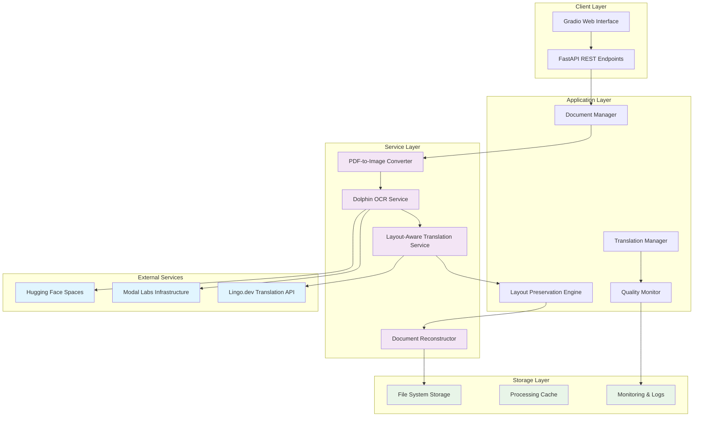

# Design Document

## Overview

This design document outlines the architectural transformation from PyMuPDF-based document processing to ByteDance's Dolphin OCR as the sole PDF processing engine. The design implements a reliable document translation system with basic layout preservation and practical error handling.

The architecture follows a microservices approach with clear separation of concerns, leveraging Modal Labs for serverless OCR processing, Hugging Face for model hosting, and maintaining the existing Lingo.dev translation pipeline with enhanced layout-aware capabilities.

## Security and Threat Model

### Simplified Security Posture

This application is designed for translating public documents (books, academic papers, research materials) that contain no personally identifiable information (PII) or sensitive data. The security model is intentionally simplified to focus on reliability and performance rather than enterprise-grade security measures.

### Threat Analysis

**Primary Threats (High Priority):**
- **Service Disruption**: External service outages (Modal Labs, Hugging Face, Lingo.dev)
- **Resource Exhaustion**: Large file uploads causing system crashes or excessive costs
- **API Quota Exhaustion**: Exceeding rate limits on external services

**Secondary Threats (Medium Priority):**
- **System Crashes**: Malformed PDF files causing application failures
- **Storage Overflow**: Accumulated temporary files consuming disk space

**Non-Threats (Explicitly Excluded):**
- **Data Theft**: Public documents have no confidentiality value
- **User Authentication**: No user accounts or access control needed
- **Data Encryption**: No sensitive data requiring protection
- **Compliance Requirements**: No PII triggers regulatory frameworks
- **Sophisticated Attacks**: No valuable target for advanced persistent threats

### Security Measures (Minimal and Practical)

**Essential Protections:**
- API key protection for external services (environment variables)
- File size limits to prevent resource exhaustion
- Basic file type validation to prevent system crashes
- Rate limiting to protect external service quotas
- Graceful error handling for service degradation

**Explicitly Omitted:**
- Data-at-rest encryption
- Complex authentication/authorization systems
- PII protection measures
- Audit logging for compliance
- Advanced threat detection
- Network security hardening

This simplified approach reduces development complexity while maintaining appropriate protection for the actual risk profile of translating public documents.

## Architecture

### High-Level System Architecture



### Processing Pipeline Architecture

```mermaid
sequenceDiagram
    participant Client
    participant API
    participant DocManager
    participant PDFConverter
    participant DolphinOCR
    participant LayoutEngine
    participant TranslationSvc
    participant Reconstructor

    Client->>API: Upload Document
    API->>DocManager: Process Request
    DocManager->>PDFConverter: Convert PDF to Images
    PDFConverter->>DolphinOCR: Send High-Res Images
    DolphinOCR->>DolphinOCR: AI-Powered OCR Processing
    DolphinOCR->>LayoutEngine: Return Structured Layout
    LayoutEngine->>TranslationSvc: Extract Translatable Text
    TranslationSvc->>TranslationSvc: Translate with Layout Constraints
    TranslationSvc->>Reconstructor: Map Translations to Layout
    Reconstructor->>Client: Return Translated Document
```## Components and Interfaces

### 1. PDF-to-Image Converter Service

**Purpose**: Replace PyMuPDF image conversion with optimized pdf2image processing

**Interface**:
class PDFToImageConverter:
    def __init__(self, dpi: int = 300, format: str = "PNG"):
        """Initialize converter with quality settings."""
        self.dpi = dpi
        self.format = format

    async def convert_pdf_to_images(self, pdf_path: str) -> List[ImageData]:
        """Convert PDF pages to high-resolution images."""
        pass

    async def convert_single_page(self, pdf_path: str, page_num: int) -> ImageData:
        """Convert specific page for targeted processing."""
        pass

    async def optimize_image_for_ocr(self, image_data: bytes) -> bytes:
        """Apply OCR-optimized image preprocessing."""
        pass

### 2. Enhanced Dolphin OCR Service

**Purpose**: Primary OCR processing engine replacing all PyMuPDF functionality

**Interface**:
class DolphinOCRService:
    def __init__(self, hf_token: str, modal_endpoint: str):
        """Initialize with Hugging Face authentication."""
        self.hf_token = hf_token
        self.modal_endpoint = modal_endpoint
        self.client = None  # Initialize HTTP client

    async def process_document_images(self, images: List[bytes]) -> Optional[DolphinResult]:
        """Process multiple images with batch optimization."""
        pass

    async def process_single_image(self, image: bytes, page_num: int) -> Optional[PageResult]:
        """Process individual page with detailed layout analysis."""
        pass

    def validate_ocr_result(self, result: dict) -> bool:
        """Validate OCR output structure and quality."""
        pass

**Data Structures**:
```python
@dataclass
class DolphinResult:
    pages: List[PageResult]
    total_pages: int
    processing_time: float
    confidence_score: float
    metadata: Dict[str, Any]

@dataclass
class PageResult:
    page_number: int
    width: float
    height: float
    text_blocks: List[TextBlock]
    layout_elements: List[LayoutElement]
    confidence: float

@dataclass
class TextBlock:
    text: str
    bbox: Tuple[float, float, float, float]
    font_info: FontInfo
    confidence: float
    element_type: str  # paragraph, heading, caption, etc.

@dataclass
class FontInfo:
    family: str
    size: float
    weight: str
    style: str
    color: Tuple[int, int, int]
```

### 3. Layout Preservation Engine

**Purpose**: Basic handling of text length variations during translation

**Interface**:
class LayoutPreservationEngine:
    def __init__(self, font_scale_limits: tuple = (0.6, 1.2), max_bbox_expansion: float = 0.3):
        """Initialize with strategy configuration."""
        self.font_scale_limits = font_scale_limits
        self.max_bbox_expansion = max_bbox_expansion

    def analyze_text_fit(self, original: str, translated: str,
                         bbox: BoundingBox, font: FontInfo) -> FitAnalysis:
        """Analyze if translated text fits in original layout."""
        pass

    def determine_layout_strategy(self, analysis: FitAnalysis) -> LayoutStrategy:
        """Determine optimal strategy for layout preservation."""
        # Strategy logic based on text length ratio, available space, etc.
        pass

    def apply_layout_adjustments(self, text: str, strategy: LayoutStrategy) -> AdjustedLayout:
        """Apply font scaling, text wrapping, or bbox expansion."""

    def calculate_quality_score(self, original_layout: Layout,
                               adjusted_layout: Layout) -> float:
        """Calculate layout preservation quality score."""
yout-Aware Translation Service

**Purpose**: Enhanced translation with layout constraints and optimization

**Interface**:
```python
class LayoutAwareTranslationService:
    def __init__(self, lingo_client: McpLingoClient, layout_engine: LayoutPreservationEngine):
        """Initialize with translation and layout services."""

    async def translate_with_layout_constraints(self,
                                              text: str,
                                              source_lang: str,
                                              target_lang: str,
                                              layout_context: LayoutContext) -> TranslationResult:
        """Translate text considering layout constraints."""

    async def translate_document_batch(self,
                                     text_blocks: List[TextBlock],
                                     source_lang: str,
                                     target_lang: str) -> List[TranslationResult]:
        """Batch translation with layout optimization."""

    def optimize_translation_for_layout(self,
                                       translation: str,
                                       constraints: LayoutConstraints) -> str:
        """Optimize translation length and structure for layout."""
```

### 5. PDF Document Reconstructor

**Purpose**: Rebuild PDF documents with translated content and preserved formatting

**Interface**:
```python
class PDFDocumentReconstructor:
    def __init__(self):
        """Initialize PDF-specific reconstructor."""
        self.supported_format = ".pdf"

    def is_pdf_format(self, file_path: str) -> bool:
        """Check if the document is a PDF format."""
        file_extension = Path(file_path).suffix.lower()
        return file_extension == self.supported_format

    def validate_pdf_format_or_raise(self, file_path: str) -> None:
        """Validate PDF format or raise exception."""
        file_extension = Path(file_path).suffix.lower()
        if file_extension != self.supported_format:
            raise UnsupportedFormatError(
                f"Unsupported format '{file_extension or '(none')}'; only PDF is supported."
            )
        # Sniff the magic number to confirm actual PDF content
        try:
            with open(file_path, "rb") as f:
                if f.read(5) != b"%PDF-":
                    raise UnsupportedFormatError(
                        "File content is not a valid PDF (missing %PDF- header)."
                    )
        except FileNotFoundError as e:
            raise UnsupportedFormatError(f"File not found: {file_path}") from e

    async def reconstruct_pdf_document(self,
                                     translated_layout: TranslatedLayout,
                                     original_file_path: str,
                                     output_path: str) -> ReconstructionResult:
        """Reconstruct PDF document with translated content."""
        self.validate_pdf_format_or_raise(original_file_path)

        try:
            return await self.reconstruct_pdf(translated_layout, original_file_path, output_path)

        except Exception as e:
            logger.error(f"PDF reconstruction failed for %s: %s", original_file_path, e, exc_info=True)
            raise DocumentReconstructionError(
                f"Failed to reconstruct PDF document: {str(e)}"
            ) from e

    async def reconstruct_pdf(self,
                            translated_layout: TranslatedLayout,
                            original_file_path: str,
                            output_path: str) -> ReconstructionResult:
        """Reconstruct PDF with translated content and layout preservation."""
        try:
            start_time = time.time()
            # Step 3: Process each page from translated layout
            for page in translated_layout.pages:
                # Step 3a: Set page dimensions from page metadata or calculate from elements
                if hasattr(page, 'width') and hasattr(page, 'height'):
                    page_width, page_height = page.width, page.height
                elif page.original_elements:
                    # Calculate page bounds from all elements
                    max_x = max(elem.bbox[2] for elem in page.original_elements)
                    max_y = max(elem.bbox[3] for elem in page.original_elements)
                    page_width, page_height = max_x, max_y
                else:
                    # Fallback to standard letter size
                    page_width, page_height = 612, 792
                    warnings.append(f"No elements found for page {page.page_number}, using default size")

                pdf_canvas.setPageSize((page_width, page_height))

                # Step 3b: Process each translated element on the page
                for element in page.translated_elements:
                    try:
                        # Step 3c: Extract positioning and font information
                        x, y, width, height = element.bbox
                        font_family = element.font_info.family or "Helvetica"
                        font_size = element.font_info.size or 12
                        font_weight = element.font_info.weight or "normal"

                        # Step 3d: Handle font registration and selection
                        if font_weight == "bold":
                            font_name = f"{font_family}-Bold"
                        else:
                            font_name = font_family

                        # Step 3e: Set font with fallback handling
                        try:
                            pdf_canvas.setFont(font_name, font_size)
                        except KeyError:
                            # Fallback to standard fonts
                            fallback_font = "Helvetica-Bold" if font_weight == "bold" else "Helvetica"
                            pdf_canvas.setFont(fallback_font, font_size)
                            warnings.append(f"Font {font_name} not available, using {fallback_font}")

                        # Step 3f: Set text color
                        if element.font_info.color:
                            r, g, b = element.font_info.color
                            pdf_canvas.setFillColorRGB(r/255, g/255, b/255)

                        # Step 3g: Handle text positioning and wrapping
                        text_lines = element.adjusted_text.split('\n')
                        line_height = font_size * 1.2  # Standard line height

                        for i, line in enumerate(text_lines):
                            line_y = y - (i * line_height)

                            # Step 3h: Check if text fits within bounding box
                            if line_y < (y - height):
                                warnings.append(f"Text overflow on page {page.page_number}: truncating content")
                                break

                            # Step 3i: Draw text line
                            pdf_canvas.drawString(x, line_y, line)

                    except Exception as element_error:
                        warnings.append(f"Failed to render element on page {page.page_number}: {element_error}")
                        continue

                # Step 3j: Finish current page
                pdf_canvas.showPage()

            # Step 4: Save and close PDF
            pdf_canvas.save()

            processing_time = time.time() - start_time

            return ReconstructionResult(
                output_path=output_path,
                format=".pdf",
                success=True,
                processing_time=processing_time,
                quality_metrics=self._calculate_pdf_quality_metrics(translated_layout),
                warnings=warnings
            )

        except Exception as e:
            raise DocumentReconstructionError(f"PDF reconstruction failed: {str(e)}") from e


    def __post_init__(self):
        """Validate data consistency after initialization."""
        if self.type == "table":
            if self.rows <= 0 or self.cols <= 0:
                raise ValueError(f"Table type requires positive dimensions, got {self.rows}x{self.cols}")

            if self.table_data is None:
                raise ValueError("Table type requires table_data to be provided")

            if len(self.table_data) != self.rows:
                raise ValueError(f"Table data has {len(self.table_data)} rows, expected {self.rows}")

            for i, row in enumerate(self.table_data):
                if len(row) != self.cols:
                    raise ValueError(f"Row {i} has {len(row)} columns, expected {self.cols}")

        elif self.type == "list" and self.list_type not in [None, "bullet", "number"]:
            raise ValueError(f"Invalid list_type: {self.list_type}")

        if not self.elements:
            raise ValueError("StructuredElementGroup must contain at least one element")
    elements: List[TranslatedElement]
    alignment: str = "left"
    list_type: Optional[str] = None  # "bullet", "number"
    rows: int = 0
    cols: int = 0
    table_data: Optional[List[List[TranslatedElement]]] = None

    def validate_pdf_reconstruction_quality(self,
                                               original: str,
                                               reconstructed: str,
                                               font_size_tolerance: float = 2.0,   # ±2pt as per Requirement 6.4
                                               position_tolerance: float = 0.05,    # ±5% as per Requirement 6.4
                                               require_exact_formatting: bool = True,
                                               enable_visual_similarity: bool = True,
                                               enable_layout_hash_check: bool = True,
                                               min_layout_fidelity: float = 0.9,
                                               min_text_content_accuracy: float = 0.95) -> QualityReport:
            """Validate PDF reconstruction quality with configurable tolerances."""
            # Validate file existence and format (format validation handles PDF check)
            if not Path(original).exists():
                raise FileNotFoundError(f"Original PDF file not found: {original}")
            if not Path(reconstructed).exists():
                raise FileNotFoundError(f"Reconstructed PDF file not found: {reconstructed}")

            # Format validation (removes redundant extension checks)
            self.validate_pdf_format_or_raise(original)
            self.validate_pdf_format_or_raise(reconstructed)

            # Perform PDF-specific quality validation with configurable parameters
            return self._validate_pdf_quality(
                original=original,
                reconstructed=reconstructed,
                font_size_tolerance=font_size_tolerance,
                position_tolerance=position_tolerance,
                require_exact_formatting=require_exact_formatting,
                enable_visual_similarity=enable_visual_similarity,
                enable_layout_hash_check=enable_layout_hash_check,
                min_layout_fidelity=min_layout_fidelity,
                min_text_content_accuracy=min_text_content_accuracy
            )
    def _validate_pdf_quality(self,
                             original: str,
                             reconstructed: str,
                             font_size_tolerance: float,
                             position_tolerance: float,
                             require_exact_formatting: bool,
                             enable_visual_similarity: bool,
                             enable_layout_hash_check: bool,
                             min_layout_fidelity: float,
                             min_text_content_accuracy: float) -> QualityReport:
        """Perform detailed PDF quality validation with configurable thresholds."""
        # Pseudo-code for PDF quality validation implementation:

        # Step 1: Extract layout information and text content from both PDFs
        original_layout = self._extract_pdf_layout(original)
        reconstructed_layout = self._extract_pdf_layout(reconstructed)

        # Step 1.1: Extract text content for accuracy validation with resource limits
        # Process documents in chunks with timeouts to prevent resource exhaustion
        original_text = self._extract_pdf_text(original, max_pages=500, timeout_per_page=30, chunk_size=50, ocr_language='eng')
        reconstructed_text = self._extract_pdf_text(reconstructed, max_pages=500, timeout_per_page=30, chunk_size=50, ocr_language='eng')

        quality_metrics = {
            "font_size_compliance": 0.0,
            "position_accuracy": 0.0,
            "formatting_exactness": 0.0,
            "visual_similarity_score": 0.0,
            "layout_hash_similarity": 0.0,
            "text_content_accuracy": 0.0,
            "overall_fidelity": 0.0
        }

        validation_warnings = []

        # Step 2: Text content accuracy validation
        quality_metrics["text_content_accuracy"] = self._compute_text_accuracy(
            original_text, reconstructed_text
        )

        if quality_metrics["text_content_accuracy"] < min_text_content_accuracy:
            validation_warnings.append(
                f"Text content accuracy {quality_metrics['text_content_accuracy']:.3f} "
                f"below minimum threshold {min_text_content_accuracy}"
            )

        # Step 3: Font size tolerance validation
        font_size_violations = 0
        total_elements = 0

        for orig_page, recon_page in zip(original_layout.pages, reconstructed_layout.pages):
            for orig_elem, recon_elem in zip(orig_page.elements, recon_page.elements):
                total_elements += 1
                font_size_diff = abs(orig_elem.font_size - recon_elem.font_size)
                if font_size_diff > font_size_tolerance:
                    font_size_violations += 1
                    validation_warnings.append(
                        f"Font size deviation {font_size_diff:.1f}pt exceeds tolerance {font_size_tolerance}pt"
                    )

        quality_metrics["font_size_compliance"] = 1.0 - (font_size_violations / max(total_elements, 1))

        # Step 4: Position tolerance validation
        position_violations = 0

        for orig_page, recon_page in zip(original_layout.pages, reconstructed_layout.pages):
            for orig_elem, recon_elem in zip(orig_page.elements, recon_page.elements):
                # Calculate relative position deviation
                orig_x, orig_y = orig_elem.bbox[0], orig_elem.bbox[1]
                recon_x, recon_y = recon_elem.bbox[0], recon_elem.bbox[1]

                x_deviation = abs(orig_x - recon_x) / max(orig_page.width, 1)
                y_deviation = abs(orig_y - recon_y) / max(orig_page.height, 1)

                if x_deviation > position_tolerance or y_deviation > position_tolerance:
                    position_violations += 1
                    validation_warnings.append(
                        f"Position deviation ({x_deviation:.3f}, {y_deviation:.3f}) exceeds tolerance {position_tolerance}"
                    )

        quality_metrics["position_accuracy"] = 1.0 - (position_violations / max(total_elements, 1))

        # Step 5: Exact formatting validation (bold, italic, underline)
        if require_exact_formatting:
            formatting_violations = 0

            for orig_page, recon_page in zip(original_layout.pages, reconstructed_layout.pages):
                for orig_elem, recon_elem in zip(orig_page.elements, recon_page.elements):
                    if (orig_elem.font_weight != recon_elem.font_weight or
                        orig_elem.font_style != recon_elem.font_style or
                        orig_elem.text_decoration != recon_elem.text_decoration):
                        formatting_violations += 1
                        validation_warnings.append(
                            f"Formatting mismatch: expected {orig_elem.font_weight}/{orig_elem.font_style}, "
                            f"got {recon_elem.font_weight}/{recon_elem.font_style}"
                        )

            quality_metrics["formatting_exactness"] = 1.0 - (formatting_violations / max(total_elements, 1))
        else:
            quality_metrics["formatting_exactness"] = 1.0  # Skip exact formatting check

        # Step 6: Visual similarity scoring (if enabled)
        if enable_visual_similarity:
            quality_metrics["visual_similarity_score"] = self._calculate_visual_similarity(
                original, reconstructed
            )

            # Enforce minimum visual similarity threshold (0.80)
            if quality_metrics["visual_similarity_score"] < 0.80:
                validation_warnings.append(
                    f"Visual similarity {quality_metrics['visual_similarity_score']:.3f} "
                    f"below minimum threshold 0.80"
                )
        else:
            quality_metrics["visual_similarity_score"] = 1.0  # Skip visual similarity

        # Step 7: Layout hash similarity scoring (if enabled)
        if enable_layout_hash_check:
            original_hash = self._calculate_layout_hash(original_layout)
            reconstructed_hash = self._calculate_layout_hash(reconstructed_layout)
            quality_metrics["layout_hash_similarity"] = self._compare_layout_hashes(
                original_hash, reconstructed_hash
            )

            # Enforce minimum layout hash similarity threshold (0.85)
            if quality_metrics["layout_hash_similarity"] < 0.85:
                validation_warnings.append(
                    f"Layout hash similarity {quality_metrics['layout_hash_similarity']:.3f} "
                    f"below minimum threshold 0.85"
                )
        else:
            quality_metrics["layout_hash_similarity"] = 1.0  # Skip hash check

        # Step 8: Simple sanity check - is the translated PDF usable?
        problems = []

        # Can we open the translated PDF?
        try:
            with open(reconstructed, 'rb') as f:
                if not f.read(4) == b'%PDF':
                    problems.append("PDF is corrupted - missing PDF header")
        except Exception:
            problems.append("Cannot open translated PDF file")

        # Is there reasonable amount of text?
        if quality_metrics["text_content_accuracy"] < 0.5:
            problems.append("Translation appears incomplete or failed")

        # Are fonts mostly preserved?
        if quality_metrics["font_size_compliance"] < 0.6:
            problems.append("Font formatting significantly degraded")

        # Is layout roughly preserved?
        if quality_metrics["position_accuracy"] < 0.5:
            problems.append("Layout structure significantly damaged")

        # Simple overall assessment
        fidelity_passed = len(problems) == 0
        quality_metrics["overall_fidelity"] = 1.0 if fidelity_passed else 0.3

        # Step 9: Report any problems found
        if problems:
            validation_warnings.extend(problems)

        return QualityReport(
            overall_score=quality_metrics["overall_fidelity"],
            font_size_compliance=quality_metrics["font_size_compliance"],
            position_accuracy=quality_metrics["position_accuracy"],
            formatting_exactness=quality_metrics["formatting_exactness"],
            visual_similarity=quality_metrics["visual_similarity_score"],
            layout_hash_similarity=quality_metrics["layout_hash_similarity"],
            text_content_accuracy=quality_metrics["text_content_accuracy"],
            validation_passed=fidelity_passed,
            warnings=validation_warnings,
            metrics_summary=quality_metrics
        )

    def _extract_pdf_text(self, pdf_path: str, max_pages: int = 500, timeout_per_page: int = 30,
                         chunk_size: int = 50, ocr_language: str = 'eng') -> str:
        """Extract text content from PDF using OCR and direct text extraction with resource safeguards.

        Uses a hybrid approach combining:
        - pdfminer.six for direct text extraction from text-based PDFs (PyMuPDF-free)
        - Tesseract OCR for image-based content and scanned documents with preprocessing
        - Page-by-page processing to minimize memory usage

        Resource Management:
        - Processes documents page-by-page to limit memory usage
        - Enforces per-page timeouts to prevent hanging on complex pages
        - Limits maximum pages processed to prevent resource exhaustion
        - Gracefully handles partial extraction when limits are exceeded
        - Uses context managers for proper resource cleanup

        Security:
        - Sanitizes file paths in error messages to prevent information disclosure
        - Validates input parameters to prevent resource exhaustion attacks

        Args:
            pdf_path: Path to the PDF file
            max_pages: Maximum number of pages to process (default: 500)
            timeout_per_page: Maximum seconds per page processing (default: 30)
            chunk_size: Number of pages to process in each chunk (default: 50)
            ocr_language: Tesseract language code for OCR (default: 'eng')

        Returns:
            Extracted text content as a single string. If extraction is partially
            completed due to resource constraints, returns text from successfully
            processed pages with a warning logged.

        Behavior on Limits:
        - If max_pages exceeded: Processes first max_pages and logs warning
        - If timeout_per_page exceeded: Skips problematic page and continues
        - If chunk processing fails: Attempts smaller chunks before failing
        """
        # Import standard libraries first (lightweight)
        import signal
        import time
        import logging
        import gc
        import os
        import subprocess
        import shutil
        from contextlib import contextmanager
        from io import StringIO

        # Heavy imports with dependency checking and graceful degradation
        try:
            from pdfminer.high_level import extract_text_to_fp
            from pdfminer.layout import LAParams
            from pdfminer.pdfpage import PDFPage
            from pdfminer.pdfinterp import PDFResourceManager, PDFPageInterpreter
            from pdfminer.converter import TextConverter
            PDFMINER_AVAILABLE = True
        except ImportError as e:
            PDFMINER_AVAILABLE = False
            logger.error(
                "pdfminer.six not available. Install with: pip install pdfminer.six\n"
                "This will disable direct PDF text extraction, falling back to OCR-only mode."
            )

        try:
            import pytesseract
            PYTESSERACT_AVAILABLE = True
        except ImportError as e:
            PYTESSERACT_AVAILABLE = False
            logger.error(
                "pytesseract not available. Install with: pip install pytesseract\n"
                "Also install Tesseract OCR system package:\n"
                "  Ubuntu/Debian: sudo apt-get install tesseract-ocr\n"
                "  macOS: brew install tesseract\n"
                "  Windows: Download from https://github.com/UB-Mannheim/tesseract/wiki\n"
                "This will disable OCR text extraction capabilities."
            )

        try:
            from pdf2image import convert_from_path
            PDF2IMAGE_AVAILABLE = True
        except ImportError as e:
            PDF2IMAGE_AVAILABLE = False
            logger.error(
                "pdf2image not available. Install with: pip install pdf2image\n"
                "Also install poppler system package:\n"
                "  Ubuntu/Debian: sudo apt-get install poppler-utils\n"
                "  macOS: brew install poppler\n"
                "  Windows: Download from https://blog.alivate.com.au/poppler-windows/\n"
                "This will disable PDF-to-image conversion for OCR processing."
            )

        try:
            from PIL import Image, ImageEnhance, ImageFilter
            PIL_AVAILABLE = True
        except ImportError as e:
            PIL_AVAILABLE = False
            logger.error(
                "PIL/Pillow not available. Install with: pip install Pillow\n"
                "This will disable image preprocessing for OCR."
            )

        # Runtime checks for external system dependencies
        def check_system_dependencies():
            """Check for required system binaries and provide installation guidance."""
            missing_deps = []

            # Check for Tesseract executable
            if PYTESSERACT_AVAILABLE:
                try:
                    subprocess.run(['tesseract', '--version'],
                                 capture_output=True, check=True, timeout=5)
                except (subprocess.CalledProcessError, FileNotFoundError, subprocess.TimeoutExpired):
                    missing_deps.append({
                        'name': 'Tesseract OCR',
                        'install_cmd': {
                            'ubuntu': 'sudo apt-get install tesseract-ocr tesseract-ocr-eng',
                            'macos': 'brew install tesseract',
                            'windows': 'Download from https://github.com/UB-Mannheim/tesseract/wiki'
                        }
                    })

            # Check for poppler utilities (pdftoppm)
            if PDF2IMAGE_AVAILABLE:
                if not shutil.which('pdftoppm'):
                    missing_deps.append({
                        'name': 'Poppler utilities',
                        'install_cmd': {
                            'ubuntu': 'sudo apt-get install poppler-utils',
                            'macos': 'brew install poppler',
                            'windows': 'Download from https://blog.alivate.com.au/poppler-windows/'
                        }
                    })

            return missing_deps

        # Check dependencies at runtime
        missing_system_deps = check_system_dependencies()
        if missing_system_deps:
            for dep in missing_system_deps:
                logger.warning(f"Missing system dependency: {dep['name']}")
                for os_name, cmd in dep['install_cmd'].items():
                    logger.warning(f"  {os_name.title()}: {cmd}")

        # Determine available capabilities based on dependencies
        capabilities = {
            'direct_text_extraction': PDFMINER_AVAILABLE,
            'ocr_processing': PYTESSERACT_AVAILABLE and len(missing_system_deps) == 0,
            'pdf_to_image': PDF2IMAGE_AVAILABLE and 'Poppler utilities' not in [d['name'] for d in missing_system_deps],
            'image_preprocessing': PIL_AVAILABLE,
            'poppler_path': os.environ.get('POPPLER_PATH')  # Allow custom poppler path configuration
        }

        # Log capability status
        logger.info(f"PDF processing capabilities: {capabilities}")

        # Early validation - ensure at least one text extraction method is available
        if not capabilities['direct_text_extraction'] and not capabilities['ocr_processing']:
            raise DocumentReconstructionError(
                "No text extraction methods available. Please install pdfminer.six and/or "
                "pytesseract with system dependencies (tesseract-ocr, poppler-utils)."
            )

        logger = logging.getLogger(__name__)
        extracted_text = ""
        pages_processed = 0
        warnings = []

        # Sanitize file path for logging (security)
        sanitized_path = os.path.basename(pdf_path) if pdf_path else "unknown_file"

        # Validate input parameters
        max_pages = min(max(1, max_pages), 2000)  # Limit between 1-2000 pages
        timeout_per_page = min(max(5, timeout_per_page), 300)  # Limit between 5-300 seconds
        chunk_size = min(max(1, chunk_size), 100)  # Limit between 1-100 pages

        @contextmanager
        def timeout_handler(seconds):
            """Context manager for per-page timeout handling."""
            def timeout_signal_handler(signum, frame):
                raise TimeoutError(f"Page processing exceeded {seconds} seconds")

            old_handler = signal.signal(signal.SIGALRM, timeout_signal_handler)
            signal.alarm(seconds)
            try:
                yield
            finally:
                signal.alarm(0)
                signal.signal(signal.SIGALRM, old_handler)

        def preprocess_image_for_ocr(image):
            """Apply image preprocessing to improve OCR accuracy with graceful degradation."""
            if not capabilities['image_preprocessing']:
                logger.warning("PIL not available, skipping image preprocessing")
                return image

            try:
                # Convert to grayscale
                if image.mode != 'L':
                    image = image.convert('L')

                # Enhance contrast
                enhancer = ImageEnhance.Contrast(image)
                image = enhancer.enhance(1.5)

                # Apply slight blur to reduce noise
                image = image.filter(ImageFilter.MedianFilter(size=3))

                # Binarization using adaptive threshold
                import numpy as np
                from PIL import ImageOps

                # Convert to numpy array for processing
                img_array = np.array(image)

                # Apply adaptive thresholding (simple version)
                threshold = np.mean(img_array) * 0.9
                binary_array = (img_array > threshold) * 255

                # Convert back to PIL Image
                binary_image = Image.fromarray(binary_array.astype(np.uint8), mode='L')

                return binary_image

            except Exception as e:
                logger.warning(f"Image preprocessing failed, using original: {e}")
                return image

        try:
            # Method 1: Direct text extraction using pdfminer.six with proper resource management
            if capabilities['direct_text_extraction']:
                with open(pdf_path, 'rb') as pdf_file:
                    # Get total page count first
                    total_pages_available = len(list(PDFPage.get_pages(pdf_file)))
                    total_pages = min(total_pages_available, max_pages)

                    if total_pages_available > max_pages:
                        warnings.append(f"PDF has {total_pages_available} pages, processing only first {max_pages} pages")
                        logger.warning(f"PDF {sanitized_path} truncated: {total_pages_available} pages -> {max_pages} pages")

                    # Reset file pointer
                    pdf_file.seek(0)

                    # Process pages in chunks to manage memory
                    for chunk_start in range(0, total_pages, chunk_size):
                        chunk_end = min(chunk_start + chunk_size, total_pages)
                        chunk_text = ""

                        # Extract text from chunk using pdfminer.six
                        try:
                            with timeout_handler(timeout_per_page * (chunk_end - chunk_start)):
                            # Reset file pointer for each chunk
                            pdf_file.seek(0)

                            # Create resource manager and text converter
                            resource_manager = PDFResourceManager()
                            output_string = StringIO()

                            with TextConverter(resource_manager, output_string, laparams=LAParams()) as converter:
                                interpreter = PDFPageInterpreter(resource_manager, converter)

                                # Process specific page range efficiently - use slicing to avoid re-reading entire file
                                pages_iterator = PDFPage.get_pages(pdf_file)

                                # Skip to chunk start efficiently
                                for _ in range(chunk_start):
                                    try:
                                        next(pages_iterator)
                                    except StopIteration:
                                        break

                                # Process only the pages in this chunk
                                for page_num in range(chunk_start, chunk_end):
                                    try:
                                        page = next(pages_iterator)
                                        interpreter.process_page(page)
                                        pages_processed += 1
                                    except StopIteration:
                                        break  # Reached end of document
                                    except Exception as page_error:
                                        warnings.append(f"Page {page_num + 1} extraction failed")
                                        logger.error(f"Page {page_num + 1} in {sanitized_path} failed: {page_error}")
                                        continue

                            chunk_text = output_string.getvalue()
                            extracted_text += chunk_text

                    except TimeoutError:
                        warnings.append(f"Chunk {chunk_start}-{chunk_end} processing timeout, skipping")
                        logger.warning(f"Chunk {chunk_start}-{chunk_end} in {sanitized_path} timed out")
                        continue
                    except Exception as chunk_error:
                        warnings.append(f"Chunk {chunk_start}-{chunk_end} extraction failed")
                        logger.error(f"Chunk {chunk_start}-{chunk_end} in {sanitized_path} failed: {chunk_error}")
                        continue

                    # Memory management: force garbage collection between chunks
                    gc.collect()

            else:
                # Direct text extraction not available, set up for OCR-only processing
                logger.warning(f"pdfminer.six not available, skipping direct text extraction for {sanitized_path}")
                total_pages = min(max_pages, 100)  # Conservative limit for OCR-only processing

            # Method 2: OCR fallback for image-based content with page-by-page processing
            should_use_ocr = (
                len(extracted_text.strip()) < 100 or  # Likely image-based PDF
                not capabilities['direct_text_extraction']  # Direct extraction not available
            )

            if should_use_ocr:
                if not capabilities['ocr_processing']:
                    logger.error(f"OCR processing not available for {sanitized_path} - missing pytesseract or system dependencies")
                    if not extracted_text.strip():
                        raise DocumentReconstructionError(
                            "No text extraction methods available. Please install pytesseract and system dependencies "
                            "(tesseract-ocr, poppler-utils) or ensure pdfminer.six is available for direct text extraction."
                        )
                else:
                    logger.info(f"Using OCR processing for {sanitized_path}")
                    ocr_text = ""

                    # Process OCR in batches to reduce PDF reopening overhead while managing memory
                    ocr_batch_size = min(chunk_size, 10)  # Smaller batches for OCR to manage memory

                    for batch_start in range(0, total_pages, ocr_batch_size):
                        batch_end = min(batch_start + ocr_batch_size, total_pages)

                        try:
                            with timeout_handler(timeout_per_page * ocr_batch_size):
                                if not capabilities['pdf_to_image']:
                                    logger.error(f"PDF-to-image conversion not available - missing pdf2image or poppler")
                                    break

                                # Convert batch of pages in single call to reduce PDF reopening
                                images = convert_from_path(
                                    pdf_path,
                                    dpi=300,
                                    first_page=batch_start + 1,
                                    last_page=batch_end,
                                    poppler_path=capabilities.get('poppler_path')
                                )

                                # Process each image in the batch
                                for i, image in enumerate(images):
                                    try:
                                        page_num = batch_start + i

                                        # Apply image preprocessing for better OCR (with graceful degradation)
                                        processed_image = preprocess_image_for_ocr(image)

                                        # Perform OCR with configurable language
                                        page_text = pytesseract.image_to_string(
                                            processed_image,
                                            lang=ocr_language,
                                            config='--psm 6'  # Assume uniform block of text
                                        )
                                        ocr_text += page_text + "\n"

                                        # Clean up individual page resources
                                        del processed_image

                                    except Exception as page_error:
                                        warnings.append(f"OCR failed on page {page_num + 1}")
                                        logger.error(f"OCR failed on page {page_num + 1} in {sanitized_path}: {page_error}")
                                        continue

                                # Clean up batch resources
                                del images
                                gc.collect()

                        except TimeoutError:
                            warnings.append(f"OCR timeout on batch {batch_start + 1}-{batch_end} ({timeout_per_page * ocr_batch_size}s)")
                            continue
                        except Exception as batch_error:
                            warnings.append(f"OCR failed on batch {batch_start + 1}-{batch_end}")
                            logger.error(f"OCR batch failed in {sanitized_path}: {batch_error}")
                            continue

                # Use OCR text if it's significantly longer
                if len(ocr_text.strip()) > len(extracted_text.strip()):
                    extracted_text = ocr_text
                    logger.info(f"Using OCR text for {sanitized_path} ({len(ocr_text)} chars vs {len(extracted_text)} chars)")

        except Exception as e:
            # Fallback to OCR-only approach with page-by-page processing
            logger.warning(f"Direct extraction failed for {sanitized_path}, attempting OCR-only fallback")

            if not capabilities['ocr_processing']:
                raise DocumentReconstructionError(
                    f"Failed to extract text from PDF: Direct extraction failed and OCR not available. "
                    f"Please install pytesseract and system dependencies (tesseract-ocr, poppler-utils)."
                )

            try:
                fallback_pages = min(max_pages, 100)  # Limit fallback to 100 pages

                # Process pages in batches to reduce PDF reopening overhead
                batch_size = min(chunk_size, 20)  # Limit batch size to prevent memory issues

                for batch_start in range(0, fallback_pages, batch_size):
                    batch_end = min(batch_start + batch_size, fallback_pages)

                    try:
                        with timeout_handler(timeout_per_page * batch_size):
                            if not capabilities['pdf_to_image']:
                                logger.error("PDF-to-image conversion not available for fallback processing")
                                break

                            # Convert batch of pages in single call to reduce PDF reopening
                            images = convert_from_path(
                                pdf_path,
                                dpi=300,
                                first_page=batch_start + 1,
                                last_page=batch_end,
                                poppler_path=capabilities.get('poppler_path')
                            )

                            # Process each image in the batch
                            for i, image in enumerate(images):
                                try:
                                    page_num = batch_start + i
                                    processed_image = preprocess_image_for_ocr(image)

                                    page_text = pytesseract.image_to_string(
                                        processed_image,
                                        lang=ocr_language,
                                        config='--psm 6'
                                    )
                                    extracted_text += page_text + "\n"
                                    pages_processed += 1

                                    # Clean up individual page resources
                                    del processed_image

                                except Exception as page_error:
                                    warnings.append(f"Fallback OCR failed on page {page_num + 1}")
                                    logger.error(f"Fallback OCR failed on page {page_num + 1}: {page_error}")
                                    continue

                            # Clean up batch resources
                            del images
                            gc.collect()

                    except TimeoutError:
                        warnings.append(f"Fallback OCR timeout on batch {batch_start + 1}-{batch_end}")
                        continue
                    except Exception as batch_error:
                        warnings.append(f"Fallback OCR failed on batch {batch_start + 1}-{batch_end}")
                        logger.error(f"Fallback OCR batch failed: {batch_error}")
                        continue

            except Exception as ocr_error:
                # Provide detailed error message with installation guidance
                error_msg = (
                    f"Failed to extract text from PDF: Direct extraction failed, OCR fallback failed. "
                    f"Error: {str(ocr_error)}. "
                )

                if not capabilities['pdf_to_image']:
                    error_msg += "Missing pdf2image or poppler-utils. "
                if not capabilities['ocr_processing']:
                    error_msg += "Missing pytesseract or tesseract-ocr. "

                error_msg += "Please check system dependencies and try again."

                raise DocumentReconstructionError(error_msg)

        # Log processing summary (without sensitive file paths)
        if warnings:
            # Aggregate warnings by category for better visibility
            warning_categories = {}
            for warning in warnings:
                # Extract warning reason (first part before details)
                if "OCR confidence" in warning.lower():
                    category = "OCR confidence low"
                elif "image corruption" in warning.lower() or "preprocessing failed" in warning.lower():
                    category = "image corruption"
                elif "page" in warning.lower() and ("skip" in warning.lower() or "timeout" in warning.lower()):
                    category = "page skip"
                elif "chunk" in warning.lower() and "timeout" in warning.lower():
                    category = "processing timeout"
                elif "pages" in warning.lower() and "truncated" in warning.lower():
                    category = "document truncated"
                else:
                    category = "other"

                warning_categories[category] = warning_categories.get(category, 0) + 1

            # Create summary message with category breakdown
            category_summary = ", ".join([f"{category}: {count}" for category, count in warning_categories.items()])
            logger.warning(f"Text extraction from {sanitized_path} completed with {len(warnings)} warnings ({category_summary})")

        # Clamp character count display for very large documents
        char_count = len(extracted_text)
        char_display = f"{char_count:,} characters" if char_count < 1000000 else f"{char_count//1000:,}k+ characters"

        logger.info(f"Extracted text from {pages_processed} pages of {sanitized_path} ({char_display})")

        return extracted_text.strip()

    def _compute_text_accuracy(self, original_text: str, reconstructed_text: str) -> float:
        """Simple text accuracy check - is the translation reasonable?

        Args:
            original_text: Text extracted from original PDF
            reconstructed_text: Text extracted from reconstructed PDF

        Returns:
            Text accuracy score between 0.0 and 1.0
        """
        # Handle empty text cases
        orig_empty = not original_text.strip()
        recon_empty = not reconstructed_text.strip()

        if orig_empty and recon_empty:
            return 1.0  # Both empty - fine
        elif orig_empty or recon_empty:
            return 0.0  # One empty, one has content - problem

        # Simple checks for reasonable translation
        orig_len = len(original_text.strip())
        recon_len = len(reconstructed_text.strip())

        # Is the translation way too short? (probably failed)
        if recon_len < orig_len * 0.5:
            return 0.3  # Low score - translation seems incomplete

        # Is the translation way too long? (probably duplicated content)
        if recon_len > orig_len * 2.0:
            return 0.7  # Medium score - might have issues but not broken

        # Length seems reasonable - assume translation worked
        return 0.95  # High score - looks good

        return min(1.0, max(0.0, accuracy_score))

    def _compare_layout_hashes(self, original_hash: str, reconstructed_hash: str) -> float:
        """Compare layout hashes and return similarity score instead of boolean equality.

        Uses optimized comparison methods:
        - Hamming distance for bit-level comparison
        - Fast similarity measure (difflib or capped LCS) for structural similarity
        - Improved prefix matching with weighted approach for hash semantics

        Performance optimizations:
        - Uses difflib.SequenceMatcher for long hashes (O(n) vs O(mn) for LCS)
        - Caps LCS calculation length to prevent performance degradation
        - Improved prefix similarity calculation to avoid excessive length penalties

        Args:
            original_hash: Layout hash from original PDF
            reconstructed_hash: Layout hash from reconstructed PDF

        Returns:
            Similarity score between 0.0 and 1.0
        """
        if original_hash == reconstructed_hash:
            return 1.0

        if not original_hash or not reconstructed_hash:
            return 0.0

        import difflib

        # Method 1: Hamming distance for same-length hashes
        if len(original_hash) == len(reconstructed_hash):
            hamming_distance = sum(c1 != c2 for c1, c2 in zip(original_hash, reconstructed_hash))
            hamming_similarity = 1.0 - (hamming_distance / len(original_hash))
        else:
            hamming_similarity = 0.0

        # Method 2: Optimized structural similarity
        # Use fast difflib for long hashes, capped LCS for shorter ones
        max_len = max(len(original_hash), len(reconstructed_hash))
        min_len = min(len(original_hash), len(reconstructed_hash))

        if max_len > 1000:  # Use difflib for long hashes to avoid O(mn) complexity
            structural_similarity = difflib.SequenceMatcher(None, original_hash, reconstructed_hash).ratio()
        else:
            # Use capped LCS for shorter hashes with length limit
            def fast_lcs_length(s1: str, s2: str, max_length: int = 500) -> int:
                # Cap input lengths to prevent performance issues
                s1_capped = s1[:max_length]
                s2_capped = s2[:max_length]

                m, n = len(s1_capped), len(s2_capped)
                dp = [[0] * (n + 1) for _ in range(m + 1)]

                for i in range(1, m + 1):
                    for j in range(1, n + 1):
                        if s1_capped[i-1] == s2_capped[j-1]:
                            dp[i][j] = dp[i-1][j-1] + 1
                        else:
                            dp[i][j] = max(dp[i-1][j], dp[i][j-1])

                return dp[m][n]

            lcs_len = fast_lcs_length(original_hash, reconstructed_hash)
            # Normalize by the length of the capped strings for fair comparison
            capped_max_len = min(max_len, 500)
            structural_similarity = lcs_len / capped_max_len if capped_max_len > 0 else 0.0

        # Method 3: Improved prefix matching with weighted approach
        prefix_matches = 0
        comparison_length = min(min_len, 100)  # Limit prefix comparison to first 100 chars

        for i in range(comparison_length):
            if original_hash[i] == reconstructed_hash[i]:
                prefix_matches += 1
            else:
                break

        # Weighted prefix similarity calculation that better reflects hash semantics
        if comparison_length > 0:
            # Base prefix similarity on the comparison length, not max length
            base_prefix_similarity = prefix_matches / comparison_length

            # Apply length penalty only if there's a significant difference
            length_ratio = min_len / max_len if max_len > 0 else 0.0
            length_penalty = 1.0 if length_ratio > 0.8 else (0.5 + 0.5 * length_ratio)

            prefix_similarity = base_prefix_similarity * length_penalty
        else:
            prefix_similarity = 0.0

        # Method 4: Suffix matching for additional structural validation
        suffix_matches = 0
        suffix_comparison_length = min(min_len, 50)  # Check last 50 characters

        if suffix_comparison_length > 0:
            for i in range(suffix_comparison_length):
                if original_hash[-(i+1)] == reconstructed_hash[-(i+1)]:
                    suffix_matches += 1
                else:
                    break

            suffix_similarity = suffix_matches / suffix_comparison_length
        else:
            suffix_similarity = 0.0

        # Weighted combination with improved balance
        # Emphasize structural similarity while considering prefix/suffix patterns
        similarity_score = (
            hamming_similarity * 0.3 +      # Exact character matching
            structural_similarity * 0.4 +   # Overall structural similarity
            prefix_similarity * 0.2 +       # Important layout header similarity
            suffix_similarity * 0.1         # Layout footer/metadata similarity
        )

        return min(1.0, max(0.0, similarity_score))

# Custom exceptions for better error handling
class UnsupportedFormatError(Exception):
    """Raised when an unsupported document format is encountered."""
    pass

class DocumentReconstructionError(Exception):
    """Raised when document reconstruction fails."""
    pass

@dataclass
class ReconstructionResult:
    """Result of document reconstruction process."""
    output_path: str
    format: str
    success: bool
    processing_time: float
    quality_metrics: QualityReport
    warnings: List[str]
    error_message: Optional[str] = None
```

### 6. Error Handling and Monitoring System

**Purpose**: Comprehensive error management with standardized codes and alerting

**Interface**:
```python
class ErrorHandler:
    ERROR_CODES = {
        "DOLPHIN_001": "Rate limit exceeded",
        "DOLPHIN_002": "Service unavailable",
        "DOLPHIN_003": "Authentication failure",
        "DOLPHIN_004": "Processing timeout",
        "DOLPHIN_005": "Invalid document format"
    }

    def handle_error(self, error: Exception, context: Dict) -> ErrorResponse:
        """Handle errors with standardized codes and logging."""

    def should_trigger_alert(self, error_type: str, frequency: int) -> bool:
        """Determine if error frequency warrants alerting."""

class MonitoringService:
    def track_performance_metrics(self, operation: str, duration: float, success: bool):
        """Track operation performance and success rates."""

    def check_alert_thresholds(self) -> List[Alert]:
        """Check if any metrics exceed alert thresholds."""

    def generate_performance_report(self, time_range: str) -> PerformanceReport:
        """Generate detailed performance and quality reports."""
```##
Data Models

### Core Data Structures

```python
@dataclass
class DocumentProcessingRequest:
    """Request for document processing."""
    file_path: str
    source_language: str
    target_language: str
    processing_options: ProcessingOptions
    user_id: Optional[str] = None
    request_id: str = field(default_factory=lambda: str(uuid.uuid4()))

@dataclass
class ProcessingOptions:
    """Configuration options for document processing."""
    dpi: int = 300
    preserve_formatting: bool = True
    quality_threshold: float = 0.8
    max_processing_time: int = 300
    enable_layout_optimization: bool = True

@dataclass
class TranslatedLayout:
    """Complete translated document layout."""
    pages: List[TranslatedPage]
    metadata: DocumentMetadata
    quality_metrics: QualityMetrics
    processing_stats: ProcessingStats

@dataclass
class TranslatedPage:
    """Single page with translated content."""
    page_number: int
    original_elements: List[LayoutElement]
    translated_elements: List[TranslatedElement]
    layout_adjustments: List[LayoutAdjustment]
    quality_score: float

@dataclass
class TranslatedElement:
    """Individual translated text element."""
    original_text: str
    translated_text: str
    adjusted_text: str
    bbox: BoundingBox
    font_info: FontInfo
    layout_strategy: str
    confidence: float

@dataclass
class QualityMetrics:
    """Quality assessment metrics."""
    ocr_confidence: float
    translation_confidence: float
    layout_preservation_score: float
    overall_quality_score: float
    processing_warnings: List[str]
```

### Configuration Models

```python
import os
from dataclasses import dataclass, field
from typing import Optional

@dataclass
class DolphinConfig:
    """Dolphin OCR service configuration with environment defaults and validation."""
    hf_token: str = field(default_factory=lambda: os.getenv("HF_TOKEN", ""))
    modal_endpoint: str = field(default_factory=lambda: os.getenv(
        "DOLPHIN_MODAL_ENDPOINT",
        "https://modal-labs--dolphin-ocr-service-dolphin-ocr-endpoint.modal.run"
    ))
    timeout_seconds: int = field(default_factory=lambda: int(os.getenv("DOLPHIN_TIMEOUT_SECONDS", "300")))
    max_retries: int = field(default_factory=lambda: int(os.getenv("DOLPHIN_MAX_RETRIES", "3")))
    batch_size: int = field(default_factory=lambda: int(os.getenv("DOLPHIN_BATCH_SIZE", "5")))

    def __post_init__(self):
        """Validate configuration after initialization."""
        self.validate()

    def validate(self) -> None:
        """Validate configuration values and raise errors for invalid settings."""
        if not self.hf_token:
            raise ValueError("HF_TOKEN is required for Dolphin OCR authentication")

        if not self.modal_endpoint:
            raise ValueError("DOLPHIN_MODAL_ENDPOINT is required")

        if not self.modal_endpoint.startswith(("http://", "https://")):
            raise ValueError("DOLPHIN_MODAL_ENDPOINT must be a valid HTTP/HTTPS URL")

        if self.timeout_seconds <= 0 or self.timeout_seconds > 3600:
            raise ValueError("DOLPHIN_TIMEOUT_SECONDS must be between 1 and 3600 seconds")

        if self.max_retries < 0 or self.max_retries > 10:
            raise ValueError("DOLPHIN_MAX_RETRIES must be between 0 and 10")

        if self.batch_size <= 0 or self.batch_size > 50:
            raise ValueError("DOLPHIN_BATCH_SIZE must be between 1 and 50")

@dataclass
class PerformanceConfig:
    """Performance and monitoring configuration with environment defaults."""
    max_concurrent_requests: int = field(default_factory=lambda: int(os.getenv("MAX_CONCURRENT_REQUESTS", "10")))
    processing_timeout: int = field(default_factory=lambda: int(os.getenv("PROCESSING_TIMEOUT", "300")))
    dpi: int = field(default_factory=lambda: int(os.getenv("PDF_DPI", "300")))
    memory_limit_mb: int = field(default_factory=lambda: int(os.getenv("MEMORY_LIMIT_MB", "2048")))

    def __post_init__(self):
        """Validate performance configuration."""
        self.validate()

    def validate(self) -> None:
        """Validate performance configuration values."""
        if self.max_concurrent_requests <= 0 or self.max_concurrent_requests > 100:
            raise ValueError("MAX_CONCURRENT_REQUESTS must be between 1 and 100")

        if self.processing_timeout <= 0 or self.processing_timeout > 1800:
            raise ValueError("PROCESSING_TIMEOUT must be between 1 and 1800 seconds")

        if self.dpi < 150 or self.dpi > 600:
            raise ValueError("PDF_DPI must be between 150 and 600 for optimal OCR quality")

        if self.memory_limit_mb < 512 or self.memory_limit_mb > 8192:
            raise ValueError("MEMORY_LIMIT_MB must be between 512 and 8192 MB")

@dataclass
class AlertThresholds:
    """Alert threshold configuration with environment defaults and validation."""
    error_rate_threshold: float = field(default_factory=lambda: float(os.getenv("ALERT_ERROR_RATE_THRESHOLD", "0.05")))
    error_rate_window: int = field(default_factory=lambda: int(os.getenv("ALERT_ERROR_RATE_WINDOW", "300")))
    critical_error_threshold: int = field(default_factory=lambda: int(os.getenv("ALERT_CRITICAL_ERROR_THRESHOLD", "3")))
    latency_threshold_multiplier: float = field(default_factory=lambda: float(os.getenv("ALERT_LATENCY_MULTIPLIER", "1.5")))
    quota_warning_threshold: float = field(default_factory=lambda: float(os.getenv("ALERT_QUOTA_WARNING_THRESHOLD", "0.8")))

    def __post_init__(self):
        """Validate alert threshold configuration."""
        self.validate()

    def validate(self) -> None:
        """Validate alert threshold values."""
        if not 0.01 <= self.error_rate_threshold <= 0.5:
            raise ValueError("ALERT_ERROR_RATE_THRESHOLD must be between 0.01 (1%) and 0.5 (50%)")

        if self.error_rate_window < 60 or self.error_rate_window > 3600:
            raise ValueError("ALERT_ERROR_RATE_WINDOW must be between 60 and 3600 seconds")

        if self.critical_error_threshold < 1 or self.critical_error_threshold > 20:
            raise ValueError("ALERT_CRITICAL_ERROR_THRESHOLD must be between 1 and 20")

        if not 1.1 <= self.latency_threshold_multiplier <= 3.0:
            raise ValueError("ALERT_LATENCY_MULTIPLIER must be between 1.1 and 3.0")

        if not 0.5 <= self.quota_warning_threshold <= 0.95:
            raise ValueError("ALERT_QUOTA_WARNING_THRESHOLD must be between 0.5 (50%) and 0.95 (95%)")

@dataclass
class QualityThresholds:
    """Quality threshold configuration with environment defaults."""
    min_ocr_confidence: float = field(default_factory=lambda: float(os.getenv("MIN_OCR_CONFIDENCE", "0.8")))
    min_translation_confidence: float = field(default_factory=lambda: float(os.getenv("MIN_TRANSLATION_CONFIDENCE", "0.7")))
    min_layout_preservation_score: float = field(default_factory=lambda: float(os.getenv("MIN_LAYOUT_PRESERVATION_SCORE", "0.7")))
    min_overall_quality_score: float = field(default_factory=lambda: float(os.getenv("MIN_OVERALL_QUALITY_SCORE", "0.8")))

    def __post_init__(self):
        """Validate quality threshold configuration."""
        self.validate()

    def validate(self) -> None:
        """Validate quality threshold values."""
        thresholds = {
            "MIN_OCR_CONFIDENCE": self.min_ocr_confidence,
            "MIN_TRANSLATION_CONFIDENCE": self.min_translation_confidence,
            "MIN_LAYOUT_PRESERVATION_SCORE": self.min_layout_preservation_score,
            "MIN_OVERALL_QUALITY_SCORE": self.min_overall_quality_score
        }

        for name, value in thresholds.items():
            if not 0.1 <= value <= 1.0:
                raise ValueError(f"{name} must be between 0.1 and 1.0")

class ConfigurationManager:
    """Centralized configuration management with validation and environment loading."""

    def __init__(self):
        """Initialize configuration manager with validated configs."""
        self.dolphin = DolphinConfig()
        self.performance = PerformanceConfig()
        self.alert_thresholds = AlertThresholds()
        self.quality_thresholds = QualityThresholds()

    def validate_all(self) -> None:
        """Validate all configuration sections."""
        self.dolphin.validate()
        self.performance.validate()
        self.alert_thresholds.validate()
        self.quality_thresholds.validate()

    def get_environment_summary(self) -> Dict[str, Any]:
        """Get summary of current configuration for logging/debugging."""
        return {
            "dolphin_endpoint": self.dolphin.modal_endpoint,
            "timeout_seconds": self.dolphin.timeout_seconds,
            "max_concurrent_requests": self.performance.max_concurrent_requests,
            "dpi": self.performance.dpi,
            "error_rate_threshold": self.alert_thresholds.error_rate_threshold,
            "min_quality_score": self.quality_thresholds.min_overall_quality_score,
            "hf_token_configured": bool(self.dolphin.hf_token)
        }
```## Erro
r Handling

### Standardized Error Taxonomy

```python
class DolphinErrorCodes:
    """Standardized error codes for Dolphin OCR system."""

    # API and Authentication Errors
    DOLPHIN_001 = "Rate limit exceeded - HuggingFace API quota reached"
    DOLPHIN_002 = "Service unavailable - Dolphin OCR service down"
    DOLPHIN_003 = "Authentication failure - Invalid HuggingFace token"

    # Processing Errors
    DOLPHIN_004 = "Processing timeout - Document too complex or large"
    DOLPHIN_005 = "Invalid document format - Unsupported file type"
    DOLPHIN_006 = "OCR processing failed - Unable to extract text"
    DOLPHIN_007 = "Layout analysis failed - Complex document structure"

    # Translation Errors
    DOLPHIN_008 = "Translation service error - Lingo.dev API failure"
    DOLPHIN_009 = "Layout preservation failed - Unable to maintain formatting"
    DOLPHIN_010 = "Document reconstruction failed - Output generation error"

    # System Errors
    DOLPHIN_011 = "Memory exhaustion - Document too large for processing"
    DOLPHIN_012 = "Storage error - Unable to save processed document"
    DOLPHIN_013 = "Configuration error - Invalid system settings"
```

### Error Handling Strategy

```python
class ErrorHandlingStrategy:
    """Comprehensive error handling with recovery mechanisms."""

    def handle_api_error(self, error: Exception, context: Dict) -> ErrorResponse:
        """Handle API-related errors with appropriate retry logic."""
        if isinstance(error, httpx.HTTPStatusError):
            if error.response.status_code == 429:
                return self._handle_rate_limit(error, context)
            elif error.response.status_code == 503:
                return self._handle_service_unavailable(error, context)
            elif error.response.status_code == 401:
                return self._handle_auth_failure(error, context)

        return self._handle_generic_error(error, context)

    def _handle_rate_limit(self, error: Exception, context: Dict) -> ErrorResponse:
        """Handle rate limiting with exponential backoff."""
        retry_after = self._extract_retry_after(error)
        return ErrorResponse(
            error_code="DOLPHIN_001",
            message="Rate limit exceeded",
            retry_after=retry_after,
            recoverable=True
        )

    def _handle_service_unavailable(self, error: Exception, context: Dict) -> ErrorResponse:
        """Handle service unavailability with fallback options."""
        return ErrorResponse(
            error_code="DOLPHIN_002",
            message="Dolphin OCR service temporarily unavailable",
            estimated_recovery_time=300,  # 5 minutes
            recoverable=True
        )
```

### Alert Management System

```python
class AlertManager:
    """Manages alerts based on error patterns and thresholds."""

    def __init__(self, config: AlertThresholds):
        self.config = config
        self.error_tracker = ErrorTracker()
        self.alert_history = AlertHistory()

    def check_error_rate_threshold(self) -> Optional[Alert]:
        """Check if error rate exceeds threshold over time window."""
        current_rate = self.error_tracker.get_error_rate(
            window_seconds=self.config.error_rate_window
        )

        if current_rate > self.config.error_rate_threshold:
            return Alert(
                type="ERROR_RATE_EXCEEDED",
                severity="HIGH",
                message=f"Error rate {current_rate:.2%} exceeds threshold {self.config.error_rate_threshold:.2%}",
                metrics={"current_rate": current_rate, "threshold": self.config.error_rate_threshold},
                suggested_actions=["Check service health", "Review recent deployments", "Scale resources"]
            )

        return None

    def check_performance_degradation(self) -> Optional[Alert]:
        """Check for performance degradation beyond SLO thresholds."""
        current_p95 = self.error_tracker.get_p95_latency(window_seconds=600)  # 10 minutes
        slo_threshold = 30.0  # 30 seconds P95 SLO
        alert_threshold = slo_threshold * self.config.latency_threshold_multiplier

        if current_p95 > alert_threshold:
            return Alert(
                type="PERFORMANCE_DEGRADATION",
                severity="MEDIUM",
                message=f"P95 latency {current_p95:.1f}s exceeds alert threshold {alert_threshold:.1f}s",
                metrics={"current_p95": current_p95, "slo": slo_threshold, "threshold": alert_threshold},
                suggested_actions=["Check Modal worker health", "Review document complexity", "Consider scaling"]
            )

        return None
```## T
esting Strategy

### Unit Testing Framework

```python
class DolphinOCRTestSuite:
    """Comprehensive test suite for Dolphin OCR migration."""

    def test_pdf_to_image_conversion(self):
        """Test PDF to image conversion with various document types."""
        test_cases = [
            ("simple_text.pdf", {"expected_pages": 1, "min_dpi": 300}),
            ("multi_column.pdf", {"expected_pages": 5, "complex_layout": True}),
            ("scanned_document.pdf", {"expected_pages": 10, "ocr_required": True})
        ]

        for pdf_file, expectations in test_cases:
            with self.subTest(pdf_file=pdf_file):
                self._test_conversion_quality(pdf_file, expectations)

    def test_ocr_accuracy_benchmarks(self):
        """Test OCR accuracy against known benchmarks."""
        benchmark_documents = [
            ("academic_paper.pdf", {"min_accuracy": 0.95, "language": "en"}),
            ("german_philosophy.pdf", {"min_accuracy": 0.92, "language": "de"}),
            ("mixed_layout.pdf", {"min_accuracy": 0.90, "complex_layout": True})
        ]

        for doc, requirements in benchmark_documents:
            accuracy = self._measure_ocr_accuracy(doc)
            self.assertGreaterEqual(accuracy, requirements["min_accuracy"])

    def test_layout_preservation_quality(self):
        """Test layout preservation across different document types."""
        test_scenarios = [
            ("font_scaling", {"length_ratio": 1.3, "expected_strategy": "font_scale"}),
            ("text_wrapping", {"length_ratio": 1.8, "expected_strategy": "text_wrap"}),
            ("hybrid_approach", {"length_ratio": 2.2, "expected_strategy": "hybrid"})
        ]

        for scenario, params in test_scenarios:
            result = self._test_layout_strategy(scenario, params)
            self.assertEqual(result.strategy_used, params["expected_strategy"])
            self.assertGreaterEqual(result.quality_score, 0.7)
```

### Integration Testing

```python
class IntegrationTestSuite:
    """End-to-end integration tests for complete workflow."""

    async def test_complete_document_processing_workflow(self):
        """Test complete workflow from upload to translated output."""
        test_document = "test_documents/sample_academic_paper.pdf"

        # Step 1: Document upload and validation
        request = DocumentProcessingRequest(
            file_path=test_document,
            source_language="en",
            target_language="de",
            processing_options=ProcessingOptions(dpi=300, preserve_formatting=True)
        )

        # Step 2: Process through complete pipeline
        result = await self.document_processor.process_document(request)

        # Step 3: Validate results
        self.assertIsNotNone(result.output_path)
        self.assertGreaterEqual(result.quality_metrics.overall_quality_score, 0.8)
        self.assertLessEqual(result.processing_stats.total_time, 300)  # 5 minutes max

        # Step 4: Validate output document
        self._validate_output_document(result.output_path, test_document)

    def test_performance_under_load(self):
        """Test system performance under concurrent load."""
        concurrent_requests = 10
        test_documents = self._generate_test_documents(concurrent_requests)

        start_time = time.time()
        results = await asyncio.gather(*[
            self.document_processor.process_document(doc) for doc in test_documents
        ])
        total_time = time.time() - start_time

        # Validate performance metrics
        successful_results = [r for r in results if r.success]
        self.assertGreaterEqual(len(successful_results), concurrent_requests * 0.9)  # 90% success rate

        total_pages = sum(r.processing_stats.pages_processed for r in successful_results)
        throughput = total_pages / (total_time / 60)  # pages per minute
        self.assertGreaterEqual(throughput, 20)  # Minimum 20 pages/minute
```

### Performance Testing

```python
class PerformanceTestSuite:
    """Performance benchmarking and SLO validation."""

    def test_processing_latency_slos(self):
        """Test processing latency against defined SLOs."""
        document_types = [
            ("scanned_documents", {"p95_slo": 30, "p99_slo": 60}),
            ("text_documents", {"p95_slo": 15, "p99_slo": 30}),
            ("complex_layouts", {"p95_slo": 45, "p99_slo": 90})
        ]

        for doc_type, slos in document_types:
            latencies = self._measure_processing_latencies(doc_type, sample_size=100)

            p95_latency = np.percentile(latencies, 95)
            p99_latency = np.percentile(latencies, 99)

            self.assertLessEqual(p95_latency, slos["p95_slo"],
                               f"P95 latency {p95_latency}s exceeds SLO {slos['p95_slo']}s for {doc_type}")
            self.assertLessEqual(p99_latency, slos["p99_slo"],
                               f"P99 latency {p99_latency}s exceeds SLO {slos['p99_slo']}s for {doc_type}")

    def test_throughput_under_concurrency(self):
        """Test system throughput under various concurrency levels."""
        concurrency_levels = [1, 5, 10, 20]

        for concurrency in concurrency_levels:
            throughput = self._measure_throughput(concurrency, duration_seconds=300)

            # Minimum throughput expectations based on concurrency
            min_expected_throughput = min(concurrency * 2, 20)  # pages/minute

            self.assertGreaterEqual(throughput, min_expected_throughput,
                                  f"Throughput {throughput} pages/min below minimum {min_expected_throughput} at concurrency {concurrency}")
```

This comprehensive design provides a solid foundation for implementing the Dolphin OCR migration with all the requirements addressed through well-defined components, interfaces, and testing strategies.
