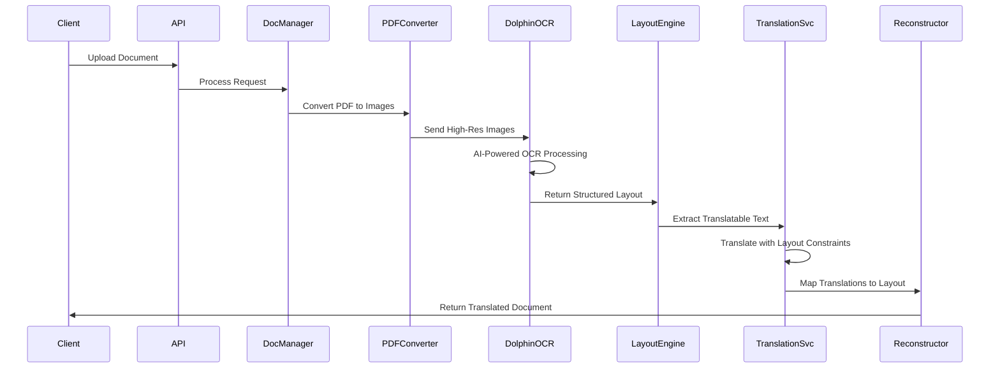

# Design Document

## Overview

This design document outlines the complete architectural transformation from PyMuPDF-based document processing to ByteDance's Dolphin OCR as the sole PDF processing engine. The design implements a high-performance, scalable document translation system with intelligent layout preservation and comprehensive error handling.

The architecture follows a microservices approach with clear separation of concerns, leveraging Modal Labs for serverless OCR processing, Hugging Face for model hosting, and maintaining the existing Lingo.dev translation pipeline with enhanced layout-aware capabilities.

## Architecture

### High-Level System Architecture


### Processing Pipeline Architecture



## Components and Interfaces

### 1. PDF-to-Image Converter Service

**Purpose**: Replace PyMuPDF image conversion with optimized pdf2image processing

**Interface**:
class PDFToImageConverter:
    def __init__(self, dpi: int = 300, format: str = "PNG"):
        """Initialize converter with quality settings."""
        self.dpi = dpi
        self.format = format

    async def convert_pdf_to_images(self, pdf_path: str) -> List[ImageData]:
        """Convert PDF pages to high-resolution images."""
        pass

    async def convert_single_page(self, pdf_path: str, page_num: int) -> ImageData:
        """Convert specific page for targeted processing."""
        pass

    async def optimize_image_for_ocr(self, image_data: bytes) -> bytes:
        """Apply OCR-optimized image preprocessing."""
        pass

### 2. Enhanced Dolphin OCR Service

**Purpose**: Primary OCR processing engine replacing all PyMuPDF functionality

**Interface**:
class DolphinOCRService:
    def __init__(self, hf_token: str, modal_endpoint: str):
        """Initialize with Hugging Face authentication."""
        self.hf_token = hf_token
        self.modal_endpoint = modal_endpoint
        self.client = None  # Initialize HTTP client

    async def process_document_images(self, images: List[bytes]) -> Optional[DolphinResult]:
        """Process multiple images with batch optimization."""
        pass

    async def process_single_image(self, image: bytes, page_num: int) -> Optional[PageResult]:
        """Process individual page with detailed layout analysis."""
        pass

    def validate_ocr_result(self, result: dict) -> bool:
        """Validate OCR output structure and quality."""
        pass

**Data Structures**:
```python
@dataclass
class DolphinResult:
    pages: List[PageResult]
    total_pages: int
    processing_time: float
    confidence_score: float
    metadata: Dict[str, Any]

@dataclass
class PageResult:
    page_number: int
    width: float
    height: float
    text_blocks: List[TextBlock]
    layout_elements: List[LayoutElement]
    confidence: float

@dataclass
class TextBlock:
    text: str
    bbox: Tuple[float, float, float, float]
    font_info: FontInfo
    confidence: float
    element_type: str  # paragraph, heading, caption, etc.

@dataclass
class FontInfo:
    family: str
    size: float
    weight: str
    style: str
    color: Tuple[int, int, int]
```

### 3. Layout Preservation Engine

**Purpose**: Intelligent handling of text length variations during translation

**Interface**:
class LayoutPreservationEngine:
    def __init__(self, font_scale_limits: tuple = (0.6, 1.2), max_bbox_expansion: float = 0.3):
        """Initialize with strategy configuration."""
        self.font_scale_limits = font_scale_limits
        self.max_bbox_expansion = max_bbox_expansion

    def analyze_text_fit(self, original: str, translated: str,
                         bbox: BoundingBox, font: FontInfo) -> FitAnalysis:
        """Analyze if translated text fits in original layout."""
        pass

    def determine_layout_strategy(self, analysis: FitAnalysis) -> LayoutStrategy:
        """Determine optimal strategy for layout preservation."""
        # Strategy logic based on text length ratio, available space, etc.
        pass

    def apply_layout_adjustments(self, text: str, strategy: LayoutStrategy) -> AdjustedLayout:
        """Apply font scaling, text wrapping, or bbox expansion."""

    def calculate_quality_score(self, original_layout: Layout,
                               adjusted_layout: Layout) -> float:
        """Calculate layout preservation quality score."""
yout-Aware Translation Service

**Purpose**: Enhanced translation with layout constraints and optimization

**Interface**:
```python
class LayoutAwareTranslationService:
    def __init__(self, lingo_client: McpLingoClient, layout_engine: LayoutPreservationEngine):
        """Initialize with translation and layout services."""

    async def translate_with_layout_constraints(self,
                                              text: str,
                                              source_lang: str,
                                              target_lang: str,
                                              layout_context: LayoutContext) -> TranslationResult:
        """Translate text considering layout constraints."""

    async def translate_document_batch(self,
                                     text_blocks: List[TextBlock],
                                     source_lang: str,
                                     target_lang: str) -> List[TranslationResult]:
        """Batch translation with layout optimization."""

    def optimize_translation_for_layout(self,
                                       translation: str,
                                       constraints: LayoutConstraints) -> str:
        """Optimize translation length and structure for layout."""
```

### 5. PDF Document Reconstructor

**Purpose**: Rebuild PDF documents with translated content and preserved formatting

**Interface**:
```python
class PDFDocumentReconstructor:
    def __init__(self):
        """Initialize PDF-specific reconstructor."""
        self.supported_format = ".pdf"

    def is_pdf_format(self, file_path: str) -> bool:
        """Check if the document is a PDF format."""
        file_extension = Path(file_path).suffix.lower()
        return file_extension == self.supported_format

    def validate_pdf_format_or_raise(self, file_path: str) -> None:
        """Validate PDF format or raise exception."""
        file_extension = Path(file_path).suffix.lower()
        if file_extension != self.supported_format:
            raise UnsupportedFormatError(
                f"Unsupported format '{file_extension or '(none')}'; only PDF is supported."
            )
        # Sniff the magic number to confirm actual PDF content
        try:
            with open(file_path, "rb") as f:
                if f.read(5) != b"%PDF-":
                    raise UnsupportedFormatError(
                        "File content is not a valid PDF (missing %PDF- header)."
                    )
        except FileNotFoundError as e:
            raise UnsupportedFormatError(f"File not found: {file_path}") from e

    async def reconstruct_pdf_document(self,
                                     translated_layout: TranslatedLayout,
                                     original_file_path: str,
                                     output_path: str) -> ReconstructionResult:
        """Reconstruct PDF document with translated content."""
        self.validate_pdf_format_or_raise(original_file_path)

        try:
            return await self.reconstruct_pdf(translated_layout, original_file_path, output_path)

        except Exception as e:
            logger.error(f"PDF reconstruction failed for %s: %s", original_file_path, e, exc_info=True)
            raise DocumentReconstructionError(
                f"Failed to reconstruct PDF document: {str(e)}"
            ) from e

    async def reconstruct_pdf(self,
                            translated_layout: TranslatedLayout,
                            original_file_path: str,
                            output_path: str) -> ReconstructionResult:
        """Reconstruct PDF with translated content and layout preservation."""
        try:
            start_time = time.time()
            # Step 3: Process each page from translated layout
            for page in translated_layout.pages:
                # Step 3a: Set page dimensions from page metadata or calculate from elements
                if hasattr(page, 'width') and hasattr(page, 'height'):
                    page_width, page_height = page.width, page.height
                elif page.original_elements:
                    # Calculate page bounds from all elements
                    max_x = max(elem.bbox[2] for elem in page.original_elements)
                    max_y = max(elem.bbox[3] for elem in page.original_elements)
                    page_width, page_height = max_x, max_y
                else:
                    # Fallback to standard letter size
                    page_width, page_height = 612, 792
                    warnings.append(f"No elements found for page {page.page_number}, using default size")

                pdf_canvas.setPageSize((page_width, page_height))

                # Step 3b: Process each translated element on the page
                for element in page.translated_elements:
                    try:
                        # Step 3c: Extract positioning and font information
                        x, y, width, height = element.bbox
                        font_family = element.font_info.family or "Helvetica"
                        font_size = element.font_info.size or 12
                        font_weight = element.font_info.weight or "normal"

                        # Step 3d: Handle font registration and selection
                        if font_weight == "bold":
                            font_name = f"{font_family}-Bold"
                        else:
                            font_name = font_family

                        # Step 3e: Set font with fallback handling
                        try:
                            pdf_canvas.setFont(font_name, font_size)
                        except KeyError:
                            # Fallback to standard fonts
                            fallback_font = "Helvetica-Bold" if font_weight == "bold" else "Helvetica"
                            pdf_canvas.setFont(fallback_font, font_size)
                            warnings.append(f"Font {font_name} not available, using {fallback_font}")

                        # Step 3f: Set text color
                        if element.font_info.color:
                            r, g, b = element.font_info.color
                            pdf_canvas.setFillColorRGB(r/255, g/255, b/255)

                        # Step 3g: Handle text positioning and wrapping
                        text_lines = element.adjusted_text.split('\n')
                        line_height = font_size * 1.2  # Standard line height

                        for i, line in enumerate(text_lines):
                            line_y = y - (i * line_height)

                            # Step 3h: Check if text fits within bounding box
                            if line_y < (y - height):
                                warnings.append(f"Text overflow on page {page.page_number}: truncating content")
                                break

                            # Step 3i: Draw text line
                            pdf_canvas.drawString(x, line_y, line)

                    except Exception as element_error:
                        warnings.append(f"Failed to render element on page {page.page_number}: {element_error}")
                        continue

                # Step 3j: Finish current page
                pdf_canvas.showPage()

            # Step 4: Save and close PDF
            pdf_canvas.save()

            processing_time = time.time() - start_time

            return ReconstructionResult(
                output_path=output_path,
                format=".pdf",
                success=True,
                processing_time=processing_time,
                quality_metrics=self._calculate_pdf_quality_metrics(translated_layout),
                warnings=warnings
            )

        except Exception as e:
            raise DocumentReconstructionError(f"PDF reconstruction failed: {str(e)}") from e


    def __post_init__(self):
        """Validate data consistency after initialization."""
        if self.type == "table":
            if self.rows <= 0 or self.cols <= 0:
                raise ValueError(f"Table type requires positive dimensions, got {self.rows}x{self.cols}")

            if self.table_data is None:
                raise ValueError("Table type requires table_data to be provided")

            if len(self.table_data) != self.rows:
                raise ValueError(f"Table data has {len(self.table_data)} rows, expected {self.rows}")

            for i, row in enumerate(self.table_data):
                if len(row) != self.cols:
                    raise ValueError(f"Row {i} has {len(row)} columns, expected {self.cols}")

        elif self.type == "list" and self.list_type not in [None, "bullet", "number"]:
            raise ValueError(f"Invalid list_type: {self.list_type}")

        if not self.elements:
            raise ValueError("StructuredElementGroup must contain at least one element")
    elements: List[TranslatedElement]
    alignment: str = "left"
    list_type: Optional[str] = None  # "bullet", "number"
    rows: int = 0
    cols: int = 0
    table_data: Optional[List[List[TranslatedElement]]] = None

    def validate_pdf_reconstruction_quality(self,
                                           original: str,
        def validate_pdf_reconstruction_quality(self,
                                               original: str,
                                               reconstructed: str,
                                               font_size_tolerance: float = 2.0,   # ±2pt as per Requirement 6.4
                                               position_tolerance: float = 0.05,    # ±5% as per Requirement 6.4
                                               require_exact_formatting: bool = True,
                                               enable_visual_similarity: bool = True,
                                               enable_layout_hash_check: bool = True,
                                               min_layout_fidelity: float = 0.9,
                                               min_text_content_accuracy: float = 0.95) -> QualityReport:
            """Validate PDF reconstruction quality with configurable tolerances."""
            # Validate file existence and format (format validation handles PDF check)
            if not Path(original).exists():
                raise FileNotFoundError(f"Original PDF file not found: {original}")
            if not Path(reconstructed).exists():
                raise FileNotFoundError(f"Reconstructed PDF file not found: {reconstructed}")

            # Format validation (removes redundant extension checks)
            self.validate_pdf_format_or_raise(original)
            self.validate_pdf_format_or_raise(reconstructed)

            # Perform PDF-specific quality validation with configurable parameters
            return self._validate_pdf_quality(
                original=original,
                reconstructed=reconstructed,
                font_size_tolerance=font_size_tolerance,
                position_tolerance=position_tolerance,
                require_exact_formatting=require_exact_formatting,
                enable_visual_similarity=enable_visual_similarity,
                enable_layout_hash_check=enable_layout_hash_check,
                min_layout_fidelity=min_layout_fidelity,
                min_text_content_accuracy=min_text_content_accuracy
            )
    def _validate_pdf_quality(self,
                             original: str,
                             reconstructed: str,
                             font_size_tolerance: float,
                             position_tolerance: float,
                             require_exact_formatting: bool,
                             enable_visual_similarity: bool,
                             enable_layout_hash_check: bool,
                             min_layout_fidelity: float) -> QualityReport:
        """Perform detailed PDF quality validation with configurable thresholds."""
        # Pseudo-code for PDF quality validation implementation:

        # Step 1: Extract layout information from both PDFs
        original_layout = self._extract_pdf_layout(original)
        reconstructed_layout = self._extract_pdf_layout(reconstructed)

        quality_metrics = {
            "font_size_compliance": 0.0,
            "position_accuracy": 0.0,
            "formatting_exactness": 0.0,
            "visual_similarity_score": 0.0,
            "layout_hash_match": False,
            "overall_fidelity": 0.0
        }

        validation_warnings = []

        # Step 2: Font size tolerance validation
        font_size_violations = 0
        total_elements = 0

        for orig_page, recon_page in zip(original_layout.pages, reconstructed_layout.pages):
            for orig_elem, recon_elem in zip(orig_page.elements, recon_page.elements):
                total_elements += 1
                font_size_diff = abs(orig_elem.font_size - recon_elem.font_size)
                if font_size_diff > font_size_tolerance:
                    font_size_violations += 1
                    validation_warnings.append(
                        f"Font size deviation {font_size_diff:.1f}pt exceeds tolerance {font_size_tolerance}pt"
                    )

        quality_metrics["font_size_compliance"] = 1.0 - (font_size_violations / max(total_elements, 1))

        # Step 3: Position tolerance validation
        position_violations = 0

        for orig_page, recon_page in zip(original_layout.pages, reconstructed_layout.pages):
            for orig_elem, recon_elem in zip(orig_page.elements, recon_page.elements):
                # Calculate relative position deviation
                orig_x, orig_y = orig_elem.bbox[0], orig_elem.bbox[1]
                recon_x, recon_y = recon_elem.bbox[0], recon_elem.bbox[1]

                x_deviation = abs(orig_x - recon_x) / max(orig_page.width, 1)
                y_deviation = abs(orig_y - recon_y) / max(orig_page.height, 1)

                if x_deviation > position_tolerance or y_deviation > position_tolerance:
                    position_violations += 1
                    validation_warnings.append(
                        f"Position deviation ({x_deviation:.3f}, {y_deviation:.3f}) exceeds tolerance {position_tolerance}"
                    )

        quality_metrics["position_accuracy"] = 1.0 - (position_violations / max(total_elements, 1))

        # Step 4: Exact formatting validation (bold, italic, underline)
        if require_exact_formatting:
            formatting_violations = 0

            for orig_page, recon_page in zip(original_layout.pages, reconstructed_layout.pages):
                for orig_elem, recon_elem in zip(orig_page.elements, recon_page.elements):
                    if (orig_elem.font_weight != recon_elem.font_weight or
                        orig_elem.font_style != recon_elem.font_style or
                        orig_elem.text_decoration != recon_elem.text_decoration):
                        formatting_violations += 1
                        validation_warnings.append(
                            f"Formatting mismatch: expected {orig_elem.font_weight}/{orig_elem.font_style}, "
                            f"got {recon_elem.font_weight}/{recon_elem.font_style}"
                        )

            quality_metrics["formatting_exactness"] = 1.0 - (formatting_violations / max(total_elements, 1))
        else:
            quality_metrics["formatting_exactness"] = 1.0  # Skip exact formatting check

        # Step 5: Visual similarity scoring (if enabled)
        if enable_visual_similarity:
            quality_metrics["visual_similarity_score"] = self._calculate_visual_similarity(
                original, reconstructed
            )
        else:
            quality_metrics["visual_similarity_score"] = 1.0  # Skip visual similarity

        # Step 6: Layout hash verification (if enabled)
        if enable_layout_hash_check:
            original_hash = self._calculate_layout_hash(original_layout)
            reconstructed_hash = self._calculate_layout_hash(reconstructed_layout)
            quality_metrics["layout_hash_match"] = (original_hash == reconstructed_hash)

            if not quality_metrics["layout_hash_match"]:
                validation_warnings.append("Layout hash mismatch detected")
        else:
            quality_metrics["layout_hash_match"] = True  # Skip hash check

        # Step 7: Calculate overall fidelity score
        quality_metrics["overall_fidelity"] = (
            quality_metrics["font_size_compliance"] * 0.25 +
            quality_metrics["position_accuracy"] * 0.35 +
            quality_metrics["formatting_exactness"] * 0.20 +
            quality_metrics["visual_similarity_score"] * 0.20
        )

        # Step 8: Validate against minimum fidelity threshold
        fidelity_passed = quality_metrics["overall_fidelity"] >= min_layout_fidelity

        if not fidelity_passed:
            validation_warnings.append(
                f"Overall fidelity {quality_metrics['overall_fidelity']:.3f} below minimum {min_layout_fidelity}"
            )

        return QualityReport(
            overall_score=quality_metrics["overall_fidelity"],
            font_size_compliance=quality_metrics["font_size_compliance"],
            position_accuracy=quality_metrics["position_accuracy"],
            formatting_exactness=quality_metrics["formatting_exactness"],
            visual_similarity=quality_metrics["visual_similarity_score"],
            layout_hash_match=quality_metrics["layout_hash_match"],
            validation_passed=fidelity_passed,
            warnings=validation_warnings,
            metrics_summary=quality_metrics
        )

# Custom exceptions for better error handling
class UnsupportedFormatError(Exception):
    """Raised when an unsupported document format is encountered."""
    pass

class DocumentReconstructionError(Exception):
    """Raised when document reconstruction fails."""
    pass

@dataclass
class ReconstructionResult:
    """Result of document reconstruction process."""
    output_path: str
    format: str
    success: bool
    processing_time: float
    quality_metrics: QualityReport
    warnings: List[str]
    error_message: Optional[str] = None
```

### 6. Error Handling and Monitoring System

**Purpose**: Comprehensive error management with standardized codes and alerting

**Interface**:
```python
class ErrorHandler:
    ERROR_CODES = {
        "DOLPHIN_001": "Rate limit exceeded",
        "DOLPHIN_002": "Service unavailable",
        "DOLPHIN_003": "Authentication failure",
        "DOLPHIN_004": "Processing timeout",
        "DOLPHIN_005": "Invalid document format"
    }

    def handle_error(self, error: Exception, context: Dict) -> ErrorResponse:
        """Handle errors with standardized codes and logging."""

    def should_trigger_alert(self, error_type: str, frequency: int) -> bool:
        """Determine if error frequency warrants alerting."""

class MonitoringService:
    def track_performance_metrics(self, operation: str, duration: float, success: bool):
        """Track operation performance and success rates."""

    def check_alert_thresholds(self) -> List[Alert]:
        """Check if any metrics exceed alert thresholds."""

    def generate_performance_report(self, time_range: str) -> PerformanceReport:
        """Generate detailed performance and quality reports."""
```##
Data Models

### Core Data Structures

```python
@dataclass
class DocumentProcessingRequest:
    """Request for document processing."""
    file_path: str
    source_language: str
    target_language: str
    processing_options: ProcessingOptions
    user_id: Optional[str] = None
    request_id: str = field(default_factory=lambda: str(uuid.uuid4()))

@dataclass
class ProcessingOptions:
    """Configuration options for document processing."""
    dpi: int = 300
    preserve_formatting: bool = True
    quality_threshold: float = 0.8
    max_processing_time: int = 300
    enable_layout_optimization: bool = True

@dataclass
class TranslatedLayout:
    """Complete translated document layout."""
    pages: List[TranslatedPage]
    metadata: DocumentMetadata
    quality_metrics: QualityMetrics
    processing_stats: ProcessingStats

@dataclass
class TranslatedPage:
    """Single page with translated content."""
    page_number: int
    original_elements: List[LayoutElement]
    translated_elements: List[TranslatedElement]
    layout_adjustments: List[LayoutAdjustment]
    quality_score: float

@dataclass
class TranslatedElement:
    """Individual translated text element."""
    original_text: str
    translated_text: str
    adjusted_text: str
    bbox: BoundingBox
    font_info: FontInfo
    layout_strategy: str
    confidence: float

@dataclass
class QualityMetrics:
    """Quality assessment metrics."""
    ocr_confidence: float
    translation_confidence: float
    layout_preservation_score: float
    overall_quality_score: float
    processing_warnings: List[str]
```

### Configuration Models

```python
import os
from dataclasses import dataclass, field
from typing import Optional

@dataclass
class DolphinConfig:
    """Dolphin OCR service configuration with environment defaults and validation."""
    hf_token: str = field(default_factory=lambda: os.getenv("HF_TOKEN", ""))
    modal_endpoint: str = field(default_factory=lambda: os.getenv(
        "DOLPHIN_MODAL_ENDPOINT",
        "https://modal-labs--dolphin-ocr-service-dolphin-ocr-endpoint.modal.run"
    ))
    timeout_seconds: int = field(default_factory=lambda: int(os.getenv("DOLPHIN_TIMEOUT_SECONDS", "300")))
    max_retries: int = field(default_factory=lambda: int(os.getenv("DOLPHIN_MAX_RETRIES", "3")))
    batch_size: int = field(default_factory=lambda: int(os.getenv("DOLPHIN_BATCH_SIZE", "5")))

    def __post_init__(self):
        """Validate configuration after initialization."""
        self.validate()

    def validate(self) -> None:
        """Validate configuration values and raise errors for invalid settings."""
        if not self.hf_token:
            raise ValueError("HF_TOKEN is required for Dolphin OCR authentication")

        if not self.modal_endpoint:
            raise ValueError("DOLPHIN_MODAL_ENDPOINT is required")

        if not self.modal_endpoint.startswith(("http://", "https://")):
            raise ValueError("DOLPHIN_MODAL_ENDPOINT must be a valid HTTP/HTTPS URL")

        if self.timeout_seconds <= 0 or self.timeout_seconds > 3600:
            raise ValueError("DOLPHIN_TIMEOUT_SECONDS must be between 1 and 3600 seconds")

        if self.max_retries < 0 or self.max_retries > 10:
            raise ValueError("DOLPHIN_MAX_RETRIES must be between 0 and 10")

        if self.batch_size <= 0 or self.batch_size > 50:
            raise ValueError("DOLPHIN_BATCH_SIZE must be between 1 and 50")

@dataclass
class PerformanceConfig:
    """Performance and monitoring configuration with environment defaults."""
    max_concurrent_requests: int = field(default_factory=lambda: int(os.getenv("MAX_CONCURRENT_REQUESTS", "10")))
    processing_timeout: int = field(default_factory=lambda: int(os.getenv("PROCESSING_TIMEOUT", "300")))
    dpi: int = field(default_factory=lambda: int(os.getenv("PDF_DPI", "300")))
    memory_limit_mb: int = field(default_factory=lambda: int(os.getenv("MEMORY_LIMIT_MB", "2048")))

    def __post_init__(self):
        """Validate performance configuration."""
        self.validate()

    def validate(self) -> None:
        """Validate performance configuration values."""
        if self.max_concurrent_requests <= 0 or self.max_concurrent_requests > 100:
            raise ValueError("MAX_CONCURRENT_REQUESTS must be between 1 and 100")

        if self.processing_timeout <= 0 or self.processing_timeout > 1800:
            raise ValueError("PROCESSING_TIMEOUT must be between 1 and 1800 seconds")

        if self.dpi < 150 or self.dpi > 600:
            raise ValueError("PDF_DPI must be between 150 and 600 for optimal OCR quality")

        if self.memory_limit_mb < 512 or self.memory_limit_mb > 8192:
            raise ValueError("MEMORY_LIMIT_MB must be between 512 and 8192 MB")

@dataclass
class AlertThresholds:
    """Alert threshold configuration with environment defaults and validation."""
    error_rate_threshold: float = field(default_factory=lambda: float(os.getenv("ALERT_ERROR_RATE_THRESHOLD", "0.05")))
    error_rate_window: int = field(default_factory=lambda: int(os.getenv("ALERT_ERROR_RATE_WINDOW", "300")))
    critical_error_threshold: int = field(default_factory=lambda: int(os.getenv("ALERT_CRITICAL_ERROR_THRESHOLD", "3")))
    latency_threshold_multiplier: float = field(default_factory=lambda: float(os.getenv("ALERT_LATENCY_MULTIPLIER", "1.5")))
    quota_warning_threshold: float = field(default_factory=lambda: float(os.getenv("ALERT_QUOTA_WARNING_THRESHOLD", "0.8")))

    def __post_init__(self):
        """Validate alert threshold configuration."""
        self.validate()

    def validate(self) -> None:
        """Validate alert threshold values."""
        if not 0.01 <= self.error_rate_threshold <= 0.5:
            raise ValueError("ALERT_ERROR_RATE_THRESHOLD must be between 0.01 (1%) and 0.5 (50%)")

        if self.error_rate_window < 60 or self.error_rate_window > 3600:
            raise ValueError("ALERT_ERROR_RATE_WINDOW must be between 60 and 3600 seconds")

        if self.critical_error_threshold < 1 or self.critical_error_threshold > 20:
            raise ValueError("ALERT_CRITICAL_ERROR_THRESHOLD must be between 1 and 20")

        if not 1.1 <= self.latency_threshold_multiplier <= 3.0:
            raise ValueError("ALERT_LATENCY_MULTIPLIER must be between 1.1 and 3.0")

        if not 0.5 <= self.quota_warning_threshold <= 0.95:
            raise ValueError("ALERT_QUOTA_WARNING_THRESHOLD must be between 0.5 (50%) and 0.95 (95%)")

@dataclass
class QualityThresholds:
    """Quality threshold configuration with environment defaults."""
    min_ocr_confidence: float = field(default_factory=lambda: float(os.getenv("MIN_OCR_CONFIDENCE", "0.8")))
    min_translation_confidence: float = field(default_factory=lambda: float(os.getenv("MIN_TRANSLATION_CONFIDENCE", "0.7")))
    min_layout_preservation_score: float = field(default_factory=lambda: float(os.getenv("MIN_LAYOUT_PRESERVATION_SCORE", "0.7")))
    min_overall_quality_score: float = field(default_factory=lambda: float(os.getenv("MIN_OVERALL_QUALITY_SCORE", "0.8")))

    def __post_init__(self):
        """Validate quality threshold configuration."""
        self.validate()

    def validate(self) -> None:
        """Validate quality threshold values."""
        thresholds = {
            "MIN_OCR_CONFIDENCE": self.min_ocr_confidence,
            "MIN_TRANSLATION_CONFIDENCE": self.min_translation_confidence,
            "MIN_LAYOUT_PRESERVATION_SCORE": self.min_layout_preservation_score,
            "MIN_OVERALL_QUALITY_SCORE": self.min_overall_quality_score
        }

        for name, value in thresholds.items():
            if not 0.1 <= value <= 1.0:
                raise ValueError(f"{name} must be between 0.1 and 1.0")

class ConfigurationManager:
    """Centralized configuration management with validation and environment loading."""

    def __init__(self):
        """Initialize configuration manager with validated configs."""
        self.dolphin = DolphinConfig()
        self.performance = PerformanceConfig()
        self.alert_thresholds = AlertThresholds()
        self.quality_thresholds = QualityThresholds()

    def validate_all(self) -> None:
        """Validate all configuration sections."""
        self.dolphin.validate()
        self.performance.validate()
        self.alert_thresholds.validate()
        self.quality_thresholds.validate()

    def get_environment_summary(self) -> Dict[str, Any]:
        """Get summary of current configuration for logging/debugging."""
        return {
            "dolphin_endpoint": self.dolphin.modal_endpoint,
            "timeout_seconds": self.dolphin.timeout_seconds,
            "max_concurrent_requests": self.performance.max_concurrent_requests,
            "dpi": self.performance.dpi,
            "error_rate_threshold": self.alert_thresholds.error_rate_threshold,
            "min_quality_score": self.quality_thresholds.min_overall_quality_score,
            "hf_token_configured": bool(self.dolphin.hf_token)
        }
```## Error Handling

### Standardized Error Taxonomy

```python
class DolphinErrorCodes:
    """Standardized error codes for Dolphin OCR system."""

    # API and Authentication Errors
    DOLPHIN_001 = "Rate limit exceeded - HuggingFace API quota reached"
    DOLPHIN_002 = "Service unavailable - Dolphin OCR service down"
    DOLPHIN_003 = "Authentication failure - Invalid HuggingFace token"

    # Processing Errors
    DOLPHIN_004 = "Processing timeout - Document too complex or large"
    DOLPHIN_005 = "Invalid document format - Unsupported file type"
    DOLPHIN_006 = "OCR processing failed - Unable to extract text"
    DOLPHIN_007 = "Layout analysis failed - Complex document structure"

    # Translation Errors
    DOLPHIN_008 = "Translation service error - Lingo.dev API failure"
    DOLPHIN_009 = "Layout preservation failed - Unable to maintain formatting"
    DOLPHIN_010 = "Document reconstruction failed - Output generation error"

    # System Errors
    DOLPHIN_011 = "Memory exhaustion - Document too large for processing"
    DOLPHIN_012 = "Storage error - Unable to save processed document"
    DOLPHIN_013 = "Configuration error - Invalid system settings"
```

### Error Handling Strategy

```python
class ErrorHandlingStrategy:
    """Comprehensive error handling with recovery mechanisms."""

    def handle_api_error(self, error: Exception, context: Dict) -> ErrorResponse:
        """Handle API-related errors with appropriate retry logic."""
        if isinstance(error, httpx.HTTPStatusError):
            if error.response.status_code == 429:
                return self._handle_rate_limit(error, context)
            elif error.response.status_code == 503:
                return self._handle_service_unavailable(error, context)
            elif error.response.status_code == 401:
                return self._handle_auth_failure(error, context)

        return self._handle_generic_error(error, context)

    def _handle_rate_limit(self, error: Exception, context: Dict) -> ErrorResponse:
        """Handle rate limiting with exponential backoff."""
        retry_after = self._extract_retry_after(error)
        return ErrorResponse(
            error_code="DOLPHIN_001",
            message="Rate limit exceeded",
            retry_after=retry_after,
            recoverable=True
        )

    def _handle_service_unavailable(self, error: Exception, context: Dict) -> ErrorResponse:
        """Handle service unavailability with fallback options."""
        return ErrorResponse(
            error_code="DOLPHIN_002",
            message="Dolphin OCR service temporarily unavailable",
            estimated_recovery_time=300,  # 5 minutes
            recoverable=True
        )
```

### Alert Management System

```python
class AlertManager:
    """Manages alerts based on error patterns and thresholds."""

    def __init__(self, config: AlertThresholds):
        self.config = config
        self.error_tracker = ErrorTracker()
        self.alert_history = AlertHistory()

    def check_error_rate_threshold(self) -> Optional[Alert]:
        """Check if error rate exceeds threshold over time window."""
        current_rate = self.error_tracker.get_error_rate(
            window_seconds=self.config.error_rate_window
        )

        if current_rate > self.config.error_rate_threshold:
            return Alert(
                type="ERROR_RATE_EXCEEDED",
                severity="HIGH",
                message=f"Error rate {current_rate:.2%} exceeds threshold {self.config.error_rate_threshold:.2%}",
                metrics={"current_rate": current_rate, "threshold": self.config.error_rate_threshold},
                suggested_actions=["Check service health", "Review recent deployments", "Scale resources"]
            )

        return None

    def check_performance_degradation(self) -> Optional[Alert]:
        """Check for performance degradation beyond SLO thresholds."""
        current_p95 = self.error_tracker.get_p95_latency(window_seconds=600)  # 10 minutes
        slo_threshold = 30.0  # 30 seconds P95 SLO
        alert_threshold = slo_threshold * self.config.latency_threshold_multiplier

        if current_p95 > alert_threshold:
            return Alert(
                type="PERFORMANCE_DEGRADATION",
                severity="MEDIUM",
                message=f"P95 latency {current_p95:.1f}s exceeds alert threshold {alert_threshold:.1f}s",
                metrics={"current_p95": current_p95, "slo": slo_threshold, "threshold": alert_threshold},
                suggested_actions=["Check Modal worker health", "Review document complexity", "Consider scaling"]
            )

        return None
```## T
esting Strategy

### Unit Testing Framework

```python
class DolphinOCRTestSuite:
    """Comprehensive test suite for Dolphin OCR migration."""

    def test_pdf_to_image_conversion(self):
        """Test PDF to image conversion with various document types."""
        test_cases = [
            ("simple_text.pdf", {"expected_pages": 1, "min_dpi": 300}),
            ("multi_column.pdf", {"expected_pages": 5, "complex_layout": True}),
            ("scanned_document.pdf", {"expected_pages": 10, "ocr_required": True})
        ]

        for pdf_file, expectations in test_cases:
            with self.subTest(pdf_file=pdf_file):
                self._test_conversion_quality(pdf_file, expectations)

    def test_ocr_accuracy_benchmarks(self):
        """Test OCR accuracy against known benchmarks."""
        benchmark_documents = [
            ("academic_paper.pdf", {"min_accuracy": 0.95, "language": "en"}),
            ("german_philosophy.pdf", {"min_accuracy": 0.92, "language": "de"}),
            ("mixed_layout.pdf", {"min_accuracy": 0.90, "complex_layout": True})
        ]

        for doc, requirements in benchmark_documents:
            accuracy = self._measure_ocr_accuracy(doc)
            self.assertGreaterEqual(accuracy, requirements["min_accuracy"])

    def test_layout_preservation_quality(self):
        """Test layout preservation across different document types."""
        test_scenarios = [
            ("font_scaling", {"length_ratio": 1.3, "expected_strategy": "font_scale"}),
            ("text_wrapping", {"length_ratio": 1.8, "expected_strategy": "text_wrap"}),
            ("hybrid_approach", {"length_ratio": 2.2, "expected_strategy": "hybrid"})
        ]

        for scenario, params in test_scenarios:
            result = self._test_layout_strategy(scenario, params)
            self.assertEqual(result.strategy_used, params["expected_strategy"])
            self.assertGreaterEqual(result.quality_score, 0.7)
```

### Integration Testing

```python
class IntegrationTestSuite:
    """End-to-end integration tests for complete workflow."""

    async def test_complete_document_processing_workflow(self):
        """Test complete workflow from upload to translated output."""
        test_document = "test_documents/sample_academic_paper.pdf"

        # Step 1: Document upload and validation
        request = DocumentProcessingRequest(
            file_path=test_document,
            source_language="en",
            target_language="de",
            processing_options=ProcessingOptions(dpi=300, preserve_formatting=True)
        )

        # Step 2: Process through complete pipeline
        result = await self.document_processor.process_document(request)

        # Step 3: Validate results
        self.assertIsNotNone(result.output_path)
        self.assertGreaterEqual(result.quality_metrics.overall_quality_score, 0.8)
        self.assertLessEqual(result.processing_stats.total_time, 300)  # 5 minutes max

        # Step 4: Validate output document
        self._validate_output_document(result.output_path, test_document)

    def test_performance_under_load(self):
        """Test system performance under concurrent load."""
        concurrent_requests = 10
        test_documents = self._generate_test_documents(concurrent_requests)

        start_time = time.time()
        results = await asyncio.gather(*[
            self.document_processor.process_document(doc) for doc in test_documents
        ])
        total_time = time.time() - start_time

        # Validate performance metrics
        successful_results = [r for r in results if r.success]
        self.assertGreaterEqual(len(successful_results), concurrent_requests * 0.9)  # 90% success rate

        total_pages = sum(r.processing_stats.pages_processed for r in successful_results)
        throughput = total_pages / (total_time / 60)  # pages per minute
        self.assertGreaterEqual(throughput, 20)  # Minimum 20 pages/minute
```

### Performance Testing

```python
class PerformanceTestSuite:
    """Performance benchmarking and SLO validation."""

    def test_processing_latency_slos(self):
        """Test processing latency against defined SLOs."""
        document_types = [
            ("scanned_documents", {"p95_slo": 30, "p99_slo": 60}),
            ("text_documents", {"p95_slo": 15, "p99_slo": 30}),
            ("complex_layouts", {"p95_slo": 45, "p99_slo": 90})
        ]

        for doc_type, slos in document_types:
            latencies = self._measure_processing_latencies(doc_type, sample_size=100)

            p95_latency = np.percentile(latencies, 95)
            p99_latency = np.percentile(latencies, 99)

            self.assertLessEqual(p95_latency, slos["p95_slo"],
                               f"P95 latency {p95_latency}s exceeds SLO {slos['p95_slo']}s for {doc_type}")
            self.assertLessEqual(p99_latency, slos["p99_slo"],
                               f"P99 latency {p99_latency}s exceeds SLO {slos['p99_slo']}s for {doc_type}")

    def test_throughput_under_concurrency(self):
        """Test system throughput under various concurrency levels."""
        concurrency_levels = [1, 5, 10, 20]

        for concurrency in concurrency_levels:
            throughput = self._measure_throughput(concurrency, duration_seconds=300)

            # Minimum throughput expectations based on concurrency
            min_expected_throughput = min(concurrency * 2, 20)  # pages/minute

            self.assertGreaterEqual(throughput, min_expected_throughput,
                                  f"Throughput {throughput} pages/min below minimum {min_expected_throughput} at concurrency {concurrency}")
```

This comprehensive design provides a solid foundation for implementing the Dolphin OCR migration with all the requirements addressed through well-defined components, interfaces, and testing strategies.
