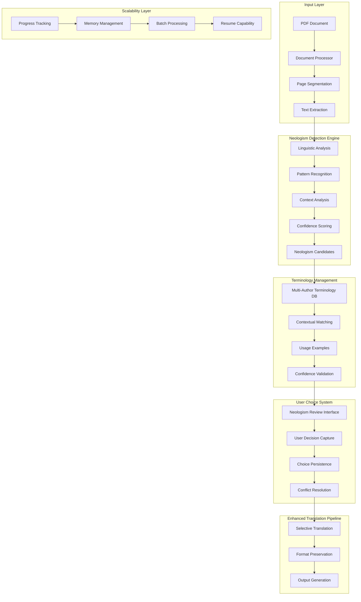

# Philosophy-Enhanced PDF Translation System Architecture

## Executive Summary

This document outlines a comprehensive architecture for enhancing the existing PDF translation system with philosophy-focused capabilities. The design prioritizes Klages terminology while creating a flexible foundation for supporting multiple philosophical traditions. The system will handle documents up to 2,000 pages with sophisticated neologism detection and user-controlled translation behavior.

## Current System Analysis

### Existing Strengths
- **Robust Translation Pipeline**: Multi-provider support (DeepL, DeepLX, Google, Azure)
- **Advanced PDF Processing**: High-resolution rendering with precise text positioning via `AdvancedPDFProcessor`
- **Comprehensive Document Support**: PDF, DOCX, TXT with format preservation
- **Layout Preservation**: Image-text overlay technique with 300 DPI rendering
- **Existing Terminology System**: Basic `klages_terminology.json` with 45 philosophical terms

### Current Limitations
- **Page Limit**: 200 pages maximum (line 518 in `app.py`)
- **Static Terminology**: No dynamic neologism detection
- **Binary Translation**: No user choice for term-by-term translation behavior
- **Single Author Focus**: Limited to predefined Klages terms
- **No Context Awareness**: Simple string replacement without linguistic analysis

## Enhanced Architecture Overview



## Core Architecture Components

### 1. Neologism Detection Engine

#### Component Structure
```python
# services/neologism_detector.py
from typing import List, Dict, Optional
from dataclasses import dataclass
import spacy
import re
from enum import Enum

class NeologismType(Enum):
    COMPOUND = "compound"
    TECHNICAL = "technical"
    DERIVED = "derived"
    PHILOSOPHICAL = "philosophical"

@dataclass
class NeologismCandidate:
    term: str
    context: str
    confidence: float
    neologism_type: NeologismType
    position: int
    morphological_analysis: Dict[str, str]
    semantic_context: List[str]
    author_specific_markers: List[str]

class LinguisticAnalyzer:
    def __init__(self):
        # Lazy loading implementation for improved startup performance
        self._nlp_de = None
        self._nlp_en = None
        self._nlp_lock = threading.Lock()
        self.philosophical_morphemes = self._load_philosophical_morphemes()
    
    @property
    def nlp_de(self):
        """Lazy loading property for German spaCy model."""
        if self._nlp_de is None:
            with self._nlp_lock:
                if self._nlp_de is None:
                    self._nlp_de = spacy.load("de_core_news_sm")
        return self._nlp_de
    
    @property
    def nlp_en(self):
        """Lazy loading property for English spaCy model."""
        if self._nlp_en is None:
            with self._nlp_lock:
                if self._nlp_en is None:
                    self._nlp_en = spacy.load("en_core_web_sm")
        return self._nlp_en
    
    def analyze_morphology(self, term: str, language: str = "german") -> Dict[str, str]:
        """Analyze morphological structure of philosophical terms"""
        doc = self.nlp_de(term) if language == "german" else self.nlp_en(term)
        
        return {
            "root": self._extract_root(term),
            "prefixes": self._extract_prefixes(term),
            "suffixes": self._extract_suffixes(term),
            "compound_parts": self._detect_compound_parts(term),
            "philosophical_markers": self._detect_philosophical_markers(term)
        }
    
    def _load_philosophical_morphemes(self) -> Dict[str, List[str]]:
        """Load philosophical morphemes for different authors"""
        return {
            "klages": {
                "prefixes": ["Lebens-", "Bewußt-", "Welt-", "Seelen-", "Geist-"],
                "suffixes": ["-feindlichkeit", "-wirklichkeit", "-heit", "-keit", "-schaft"],
                "roots": ["Leben", "Geist", "Seele", "Wille", "Trieb", "Rhythmus"]
            },
            "heidegger": {
                "prefixes": ["Sein-", "Da-", "Mit-", "Zu-"],
                "suffixes": ["-sein", "-heit", "-keit", "-ung"],
                "roots": ["Sein", "Da", "Welt", "Zeit"]
            }
        }

class PatternRecognizer:
    def __init__(self):
        self.compound_patterns = self._load_compound_patterns()
        self.capitalization_patterns = self._load_capitalization_patterns()
    
    def recognize_compounds(self, text: str, author: str = "klages") -> List[str]:
        """Recognize compound philosophical terms"""
        compounds = []
        
        # German compound detection patterns
        compound_regex = r'\b[A-Z][a-z]+(?:[A-Z][a-z]+)+\b'
        matches = re.findall(compound_regex, text)
        
        for match in matches:
            if self._is_philosophical_compound(match, author):
                compounds.append(match)
        
        return compounds
    
    def _is_philosophical_compound(self, term: str, author: str) -> bool:
        """Check if compound term is philosophical"""
        author_patterns = self.compound_patterns.get(author, {})
        
        for prefix in author_patterns.get("prefixes", []):
            if term.startswith(prefix):
                return True
        
        for suffix in author_patterns.get("suffixes", []):
            if term.endswith(suffix):
                return True
        
        return False

class ContextAnalyzer:
    def __init__(self):
        self.philosophical_context_words = self._load_context_words()
        self.semantic_fields = self._load_semantic_fields()
    
    def analyze_context(self, term: str, context: str, author: str = "klages") -> Dict[str, float]:
        """Analyze semantic context around potential neologism"""
        context_words = context.split()
        term_position = self._find_term_position(term, context_words)
        
        window_size = 10
        start = max(0, term_position - window_size)
        end = min(len(context_words), term_position + window_size + 1)
        
        context_window = context_words[start:end]
        
        return {
            "philosophical_density": self._calculate_philosophical_density(context_window, author),
            "semantic_coherence": self._calculate_semantic_coherence(context_window, author),
            "author_specificity": self._calculate_author_specificity(context_window, author)
        }
    
    def _calculate_philosophical_density(self, context_words: List[str], author: str) -> float:
        """Calculate density of philosophical terms in context"""
        philosophical_terms = self.philosophical_context_words.get(author, [])
        matches = sum(1 for word in context_words if word in philosophical_terms)
        return matches / len(context_words) if context_words else 0.0

class NeologismDetector:
    def __init__(self, terminology_manager):
        self.terminology_manager = terminology_manager
        self.linguistic_analyzer = LinguisticAnalyzer()
        self.pattern_recognizer = PatternRecognizer()
        self.context_analyzer = ContextAnalyzer()
        self.confidence_threshold = 0.7
    
    def detect_neologisms(self, text: str, author_context: str = "klages") -> List[NeologismCandidate]:
        """Detect philosophical neologisms in text with confidence scoring"""
        candidates = []
        
        # 1. Pattern-based detection
        compounds = self.pattern_recognizer.recognize_compounds(text, author_context)
        
        # 2. Morphological analysis
        for compound in compounds:
            if self._is_potential_neologism(compound, author_context):
                morphology = self.linguistic_analyzer.analyze_morphology(compound)
                context_analysis = self.context_analyzer.analyze_context(compound, text, author_context)
                confidence = self._calculate_confidence(compound, morphology, context_analysis)
                
                if confidence >= self.confidence_threshold:
                    candidate = NeologismCandidate(
                        term=compound,
                        context=self._extract_context(compound, text),
                        confidence=confidence,
                        neologism_type=self._classify_neologism(compound, morphology),
                        position=text.find(compound),
                        morphological_analysis=morphology,
                        semantic_context=self._extract_semantic_context(compound, text),
                        author_specific_markers=self._extract_author_markers(compound, author_context)
                    )
                    candidates.append(candidate)
        
        return candidates
    
    def _calculate_confidence(self, term: str, morphology: Dict, context_analysis: Dict) -> float:
        """Calculate confidence score for neologism detection"""
        base_score = 0.0
        
        # Morphological complexity (0.0-0.3)
        if len(morphology.get("compound_parts", [])) > 1:
            base_score += 0.2
        if morphology.get("philosophical_markers"):
            base_score += 0.1
        
        # Context density (0.0-0.4)
        context_score = context_analysis.get("philosophical_density", 0.0)
        base_score += context_score * 0.4
        
        # Rarity factor (0.0-0.3)
        rarity_score = self._calculate_rarity(term)
        base_score += rarity_score * 0.3
        
        return min(base_score, 1.0)
    
    def _is_potential_neologism(self, term: str, author: str) -> bool:
        """Check if term is potentially a neologism"""
        # Check if term is already in known terminology
        if self.terminology_manager.has_term(term, author):
            return False
        
        # Check minimum length and complexity
        if len(term) < 6:
            return False
        
        # Check for philosophical characteristics
        return self._has_philosophical_characteristics(term, author)
```

#### Detection Strategies

**1. Pattern-Based Detection**
- **German Compound Recognition**: Identify philosophical compound terms (e.g., "Lebensfeindlichkeit", "Weltanschauung")
- **Morphological Analysis**: Detect word roots, prefixes, suffixes common in philosophical terminology
- **Capitalization Patterns**: German noun capitalization as indicator of philosophical concepts

**2. Context-Aware Analysis**
- **Semantic Field Analysis**: Identify clusters of related philosophical concepts
- **Syntactic Context**: Analyze grammatical structures typical of philosophical discourse
- **Co-occurrence Patterns**: Detect terms that frequently appear together in philosophical texts

**3. Confidence Scoring Algorithm**
The confidence scoring system evaluates multiple factors:
- Morphological complexity (compounds get higher scores)
- Context philosophical density (nearby known terms)
- Capitalization patterns (German philosophical nouns)
- Frequency rarity (uncommon terms more likely neologisms)
- Author-specific patterns (Klages terminology patterns)

### 2. Enhanced Terminology Management

#### Multi-Author Terminology Database Schema
```python
# services/terminology_manager.py
from typing import Dict, List, Optional
from dataclasses import dataclass, asdict
from datetime import datetime
import json
import sqlite3

@dataclass
class TerminologyEntry:
    term: str
    author: str
    translations: Dict[str, str]  # language -> translation
    definition: str
    usage_examples: List[str]
    context_tags: List[str]
    confidence_threshold: float
    created_at: datetime
    updated_at: datetime
    usage_frequency: int
    compound_variants: List[str]
    semantic_field: str
    morphological_type: str
    
    def to_dict(self) -> Dict:
        """Convert to dictionary for JSON serialization"""
        return asdict(self)

@dataclass
class AuthorProfile:
    name: str
    full_name: str
    time_period: str
    language: str
    philosophical_school: str
    terminology_patterns: Dict[str, List[str]]
    compound_prefixes: List[str]
    characteristic_suffixes: List[str]
    semantic_fields: List[str]
    
@dataclass
class TermMatch:
    term: str
    author: str
    confidence: float
    context: str
    position: int
    suggested_translation: str
    alternatives: List[str]

class TerminologyManager:
    def __init__(self, db_path: str = "config/enhanced_terminology.json"):
        self.db_path = db_path
        self.sqlite_db = "data/terminology.db"
        self.terminology_db: Dict[str, AuthorProfile] = {}
        self.term_cache: Dict[str, TerminologyEntry] = {}
        self.init_database()
        self.load_terminology_database()
    
    def init_database(self):
        """Initialize SQLite database for terminology management"""
        with sqlite3.connect(self.sqlite_db) as conn:
            conn.execute("""
                CREATE TABLE IF NOT EXISTS terminology_entries (
                    id INTEGER PRIMARY KEY,
                    term TEXT NOT NULL,
                    author TEXT NOT NULL,
                    language TEXT NOT NULL,
                    definition TEXT,
                    usage_examples TEXT,
                    context_tags TEXT,
                    confidence_threshold REAL,
                    created_at DATETIME,
                    updated_at DATETIME,
                    usage_frequency INTEGER DEFAULT 0,
                    compound_variants TEXT,
                    semantic_field TEXT,
                    morphological_type TEXT,
                    UNIQUE(term, author, language)
                )
            """)
            
            conn.execute("""
                CREATE TABLE IF NOT EXISTS author_profiles (
                    id INTEGER PRIMARY KEY,
                    name TEXT UNIQUE NOT NULL,
                    full_name TEXT,
                    time_period TEXT,
                    language TEXT,
                    philosophical_school TEXT,
                    terminology_patterns TEXT,
                    compound_prefixes TEXT,
                    characteristic_suffixes TEXT,
                    semantic_fields TEXT
                )
            """)
            
            conn.execute("""
                CREATE INDEX IF NOT EXISTS idx_term_author ON terminology_entries(term, author)
            """)
            
            conn.execute("""
                CREATE INDEX IF NOT EXISTS idx_semantic_field ON terminology_entries(semantic_field)
            """)
    
    def load_terminology_database(self):
        """Load multi-author terminology database"""
        try:
            with open(self.db_path, 'r', encoding='utf-8') as f:
                data = json.load(f)
            
            for author_key, author_data in data.get('terminology_database', {}).items():
                # Create author profile
                metadata = author_data.get('metadata', {})
                patterns = author_data.get('patterns', {})
                
                profile = AuthorProfile(
                    name=author_key,
                    full_name=metadata.get('full_name', ''),
                    time_period=metadata.get('period', ''),
                    language=metadata.get('primary_language', ''),
                    philosophical_school=metadata.get('philosophical_school', ''),
                    terminology_patterns=patterns,
                    compound_prefixes=patterns.get('compound_prefixes', []),
                    characteristic_suffixes=patterns.get('characteristic_suffixes', []),
                    semantic_fields=patterns.get('semantic_fields', [])
                )
                
                self.terminology_db[author_key] = profile
                
                # Load terms into database
                for term, term_data in author_data.get('terms', {}).items():
                    entry = TerminologyEntry(
                        term=term,
                        author=author_key,
                        translations=term_data.get('translations', {}),
                        definition=term_data.get('definition', ''),
                        usage_examples=term_data.get('usage_examples', []),
                        context_tags=term_data.get('context_tags', []),
                        confidence_threshold=term_data.get('confidence_threshold', 0.7),
                        created_at=datetime.now(),
                        updated_at=datetime.now(),
                        usage_frequency=0,
                        compound_variants=term_data.get('compounds', []),
                        semantic_field=term_data.get('semantic_field', ''),
                        morphological_type=term_data.get('morphological_type', '')
                    )
                    
                    self.add_term_to_database(entry)
                    self.term_cache[f"{term}_{author_key}"] = entry
        
        except Exception as e:
            print(f"Error loading terminology database: {e}")
            # Load minimal default terminology or raise exception
            logger.error(f"Failed to load terminology database: {e}")
            # Initialize with empty database
            self.terminology_db = {}
            self.term_cache = {}
    
    def add_term_to_database(self, entry: TerminologyEntry):
        """Add terminology entry to SQLite database"""
        with sqlite3.connect(self.sqlite_db) as conn:
            conn.execute("""
                INSERT OR REPLACE INTO terminology_entries 
                (term, author, language, definition, usage_examples, context_tags, 
                 confidence_threshold, created_at, updated_at, usage_frequency,
                 compound_variants, semantic_field, morphological_type)
                VALUES (?, ?, ?, ?, ?, ?, ?, ?, ?, ?, ?, ?, ?)
            """, (
                entry.term, entry.author, 'german', entry.definition,
                json.dumps(entry.usage_examples), json.dumps(entry.context_tags),
                entry.confidence_threshold, entry.created_at, entry.updated_at,
                entry.usage_frequency, json.dumps(entry.compound_variants),
                entry.semantic_field, entry.morphological_type
            ))
    
    def get_author_terms(self, author: str) -> List[TerminologyEntry]:
        """Get all terms for a specific author"""
        with sqlite3.connect(self.sqlite_db) as conn:
            cursor = conn.execute("""
                SELECT * FROM terminology_entries WHERE author = ?
            """, (author,))
            
            entries = []
            for row in cursor.fetchall():
                entry = self._row_to_terminology_entry(row)
                entries.append(entry)
            
            return entries
    
    def find_matching_terms(self, text: str, author: str = "klages") -> List[TermMatch]:
        """Find terminology matches in text with context"""
        matches = []
        terms = self.get_author_terms(author)
        
        for term_entry in terms:
            # Simple substring matching (can be enhanced with fuzzy matching)
            if term_entry.term.lower() in text.lower():
                position = text.lower().find(term_entry.term.lower())
                context = self._extract_context(text, position, term_entry.term)
                
                match = TermMatch(
                    term=term_entry.term,
                    author=author,
                    confidence=0.9,  # High confidence for exact matches
                    context=context,
                    position=position,
                    suggested_translation=term_entry.translations.get('en', term_entry.term),
                    alternatives=list(term_entry.translations.values())
                )
                matches.append(match)
        
        return matches
    
    def add_user_term(self, term: str, author: str, user_translation: str, 
                     definition: str = "", context_tags: List[str] = None):
        """Add user-defined terminology"""
        if context_tags is None:
            context_tags = []
        
        entry = TerminologyEntry(
            term=term,
            author=author,
            translations={'en': user_translation},
            definition=definition,
            usage_examples=[],
            context_tags=context_tags,
            confidence_threshold=0.8,
            created_at=datetime.now(),
            updated_at=datetime.now(),
            usage_frequency=1,
            compound_variants=[],
            semantic_field='user_defined',
            morphological_type='user_defined'
        )
        
        self.add_term_to_database(entry)
        self.term_cache[f"{term}_{author}"] = entry
    
    def update_usage_frequency(self, term: str, author: str):
        """Update term usage statistics"""
        with sqlite3.connect(self.sqlite_db) as conn:
            conn.execute("""
                UPDATE terminology_entries 
                SET usage_frequency = usage_frequency + 1, updated_at = ?
                WHERE term = ? AND author = ?
            """, (datetime.now(), term, author))
    
    def has_term(self, term: str, author: str) -> bool:
        """Check if term exists in terminology database"""
        cache_key = f"{term}_{author}"
        if cache_key in self.term_cache:
            return True
        
        with sqlite3.connect(self.sqlite_db) as conn:
            cursor = conn.execute("""
                SELECT 1 FROM terminology_entries WHERE term = ? AND author = ?
            """, (term, author))
            return cursor.fetchone() is not None
    
    def get_term(self, term: str, author: str) -> Optional[TerminologyEntry]:
        """Get specific terminology entry"""
        cache_key = f"{term}_{author}"
        if cache_key in self.term_cache:
            return self.term_cache[cache_key]
        
        with sqlite3.connect(self.sqlite_db) as conn:
            cursor = conn.execute("""
                SELECT * FROM terminology_entries WHERE term = ? AND author = ?
            """, (term, author))
            row = cursor.fetchone()
            
            if row:
                entry = self._row_to_terminology_entry(row)
                self.term_cache[cache_key] = entry
                return entry
        
        return None
    
    def _row_to_terminology_entry(self, row) -> TerminologyEntry:
def _row_to_terminology_entry(self, row) -> TerminologyEntry:
    """Convert database row to TerminologyEntry"""
    return TerminologyEntry(
        term=row[1],
        author=row[2],
        translations={},  # Translations are not stored in this table
        definition=row[4] or "",
        usage_examples=json.loads(row[5]) if row[5] else [],
        context_tags=json.loads(row[6]) if row[6] else [],
        confidence_threshold=row[7] or 0.7,
        created_at=datetime.fromisoformat(row[8]) if row[8] else datetime.now(),
        updated_at=datetime.fromisoformat(row[9]) if row[9] else datetime.now(),
        usage_frequency=row[10] or 0,
        compound_variants=json.loads(row[11]) if row[11] else [],
        semantic_field=row[12] or "",
        morphological_type=row[13] or ""
    )
    
    def _extract_context(self, text: str, position: int, term: str, window_size: int = 50) -> str:
        """Extract context around term position"""
        start = max(0, position - window_size)
        end = min(len(text), position + len(term) + window_size)
        return text[start:end]
```

#### Extended Configuration Structure
```json
{
  "terminology_database": {
    "klages": {
      "metadata": {
        "full_name": "Ludwig Klages",
        "period": "1872-1956",
        "primary_language": "German",
        "philosophical_school": "Lebensphilosophie"
      },
      "patterns": {
        "compound_prefixes": ["Lebens-", "Bewußt-", "Welt-", "Seelen-", "Geist-"],
        "characteristic_suffixes": ["-keit", "-heit", "-schaft", "-feindlichkeit", "-wirklichkeit"],
        "typical_constructions": ["Noun+feindlich", "Adj+wirklichkeit"],
        "semantic_fields": ["life_philosophy", "consciousness", "spirit", "soul", "will"]
      },
      "terms": {
        "Lebensfeindlichkeit": {
          "translations": {
            "en": "Life-hostility",
            "fr": "Hostilité à la vie",
            "es": "Hostilidad a la vida"
          },
          "definition": "Klages' concept of the fundamental opposition between spirit and life",
          "usage_examples": [
            "Die Lebensfeindlichkeit des Geistes zeigt sich in der Technik.",
            "Klages sieht in der Zivilisation eine Form der Lebensfeindlichkeit."
          ],
          "context_tags": ["spirit", "life", "opposition", "technology"],
          "confidence_threshold": 0.8,
          "compounds": ["lebensfeindlich", "Lebensfeind"],
          "semantic_field": "life_philosophy",
          "morphological_type": "compound_noun"
        },
        "Bewußtseinsenge": {
          "translations": {
            "en": "Narrowness of consciousness",
            "fr": "Étroitesse de la conscience"
          },
          "definition": "The limiting nature of rational consciousness according to Klages",
          "usage_examples": [
            "Die Bewußtseinsenge verhindert die volle Lebenserfahrung."
          ],
          "context_tags": ["consciousness", "limitation", "rationality"],
          "confidence_threshold": 0.85,
          "compounds": ["bewußtseinseng"],
          "semantic_field": "consciousness",
          "morphological_type": "compound_noun"
        }
      }
    }
  }
}
```

### 3. User Choice Management System

#### Data Models
```python
# services/user_choice_manager.py
from typing import Dict, List, Optional
from dataclasses import dataclass
from datetime import datetime
import json
import sqlite3
import hashlib

@dataclass
class UserChoice:
    term: str
    author: str
    source_language: str
    target_language: str
    choice_type: str  # "translate", "preserve", "custom"
    custom_translation: Optional[str]
    context: str
    confidence: float
    timestamp: datetime
    document_id: str
    context_hash: str
    
    def to_dict(self) -> Dict:
        return {
            'term': self.term,
            'author': self.author,
            'source_language': self.source_language,
            'target_language': self.target_language,
            'choice_type': self.choice_type,
            'custom_translation': self.custom_translation,
            'context': self.context,
            'confidence': self.confidence,
            'timestamp': self.timestamp.isoformat(),
            'document_id': self.document_id,
            'context_hash': self.context_hash
        }

@dataclass
class TranslationSession:
    session_id: str
    document_path: str
    user_choices: List[UserChoice]
    processing_status: str
    created_at: datetime
    author_context: str
    total_neologisms: int
    processed_neologisms: int
    
class UserChoiceManager:
    def __init__(self, db_path: str = "data/user_choices.db"):
        self.db_path = db_path
        self.active_sessions: Dict[str, TranslationSession] = {}
        self.choice_cache: Dict[str, UserChoice] = {}
        self.init_database()
    
    def init_database(self):
        """Initialize SQLite database for user choices"""
        with sqlite3.connect(self.db_path) as conn:
            conn.execute("""
                CREATE TABLE IF NOT EXISTS user_choices (
                    id INTEGER PRIMARY KEY,
                    term TEXT NOT NULL,
                    author TEXT NOT NULL,
                    source_lang TEXT NOT NULL,
                    target_lang TEXT NOT NULL,
                    choice_type TEXT NOT NULL,
                    custom_translation TEXT,
                    context TEXT,
                    confidence REAL,
                    timestamp DATETIME,
                    document_id TEXT,
                    context_hash TEXT,
                    UNIQUE(term, author, context_hash)
                )
            """)
            
            conn.execute("""
                CREATE TABLE IF NOT EXISTS translation_sessions (
                    session_id TEXT PRIMARY KEY,
                    document_path TEXT NOT NULL,
                    author_context TEXT,
                    total_neologisms INTEGER,
                    processed_neologisms INTEGER,
                    processing_status TEXT,
                    created_at DATETIME,
                    updated_at DATETIME
                )
            """)
            
            conn.execute("""
                CREATE INDEX IF NOT EXISTS idx_term_author_hash 
                ON user_choices(term, author, context_hash)
            """)
    
    def create_session(self, document_path: str, author: str) -> str:
        """Create new translation session"""
        session_id = self._generate_session_id()
        
        session = TranslationSession(
            session_id=session_id,
            document_path=document_path,
            user_choices=[],
            processing_status="initialized",
            created_at=datetime.now(),
            author_context=author,
            total_neologisms=0,
            processed_neologisms=0
        )
        
        self.active_sessions[session_id] = session
        
        # Persist session to database
        with sqlite3.connect(self.db_path) as conn:
            conn.execute("""
                INSERT INTO translation_sessions 
                (session_id, document_path, author_context, total_neologisms, 
                 processed_neologisms, processing_status, created_at, updated_at)
                VALUES (?, ?, ?, ?, ?, ?, ?, ?)
            """, (
                session_id, document_path, author, 0, 0, "initialized", 
                datetime.now(), datetime.now()
            ))
        
        return session_id
    
    def record_choice(self, session_id: str, choice: UserChoice):
        """Record user choice for neologism translation"""
        # Add to active session
        if session_id in self.active_sessions:
            self.active_sessions[session_id].user_choices.append(choice)
        
        # Cache choice for quick lookup
        cache_key = f"{choice.term}_{choice.author}_{choice.context_hash}"
        self.choice_cache[cache_key] = choice
        
        # Persist to database
        with sqlite3.connect(self.db_path) as conn:
            conn.execute("""
                INSERT OR REPLACE INTO user_choices 
                (term, author, source_lang, target_lang, choice_type, 
                 custom_translation, context, confidence, timestamp, 
                 document_id, context_hash)
                VALUES (?, ?, ?, ?, ?, ?, ?, ?, ?, ?, ?)
            """, (
                choice.term, choice.author, choice.source_language, 
                choice.target_language, choice.choice_type, 
                choice.custom_translation, choice.context, 
                choice.confidence, choice.timestamp, 
                choice.document_id, choice.context_hash
            ))
    
    def get_user_preference(self, term: str, author: str, context: str) -> Optional[UserChoice]:
        """Get user's previous choice for similar context"""
        context_hash = self._hash_context(context)
        cache_key = f"{term}_{author}_{context_hash}"
        
        # Check cache first
        if cache_key in self.choice_cache:
            return self.choice_cache[cache_key]
        
        # Query database
        with sqlite3.connect(self.db_path) as conn:
            cursor = conn.execute("""
                SELECT * FROM user_choices 
                WHERE term = ? AND author = ? AND context_hash = ?
                ORDER BY timestamp DESC LIMIT 1
            """, (term, author, context_hash))
            
            row = cursor.fetchone()
            if row:
                choice = self._row_to_user_choice(row)
                self.choice_cache[cache_key] = choice
                return choice
        
        # If no exact match, look for similar contexts
        return self._find_similar_choice(term, author, context)
    
    def resolve_conflicts(self, term: str, choices: List[UserChoice]) -> UserChoice:
        """Resolve conflicting user choices using context similarity"""
        if not choices:
            return None
        
        if len(choices) == 1:
            return choices[0]
        
        # Sort by timestamp (most recent first)
        choices.sort(key=lambda x: x.timestamp, reverse=True)
        
        # For now, return the most recent choice
        # In the future, this could be enhanced with semantic similarity
        return choices[0]
    
    def get_session_choices(self, session_id: str) -> List[UserChoice]:
        """Get all user choices for a session"""
        if session_id in self.active_sessions:
            return self.active_sessions[session_id].user_choices
        return []
    
    def update_session_status(self, session_id: str, status: str):
        """Update session processing status"""
        if session_id in self.active_sessions:
            self.active_sessions[session_id].processing_status = status
        
        with sqlite3.connect(self.db_path) as conn:
            conn.execute("""
                UPDATE translation_sessions 
                SET processing_status = ?, updated_at = ?
                WHERE session_id = ?
            """, (status, datetime.now(), session_id))
    
    def _generate_session_id(self) -> str:
        """Generate unique session ID"""
        import uuid
        return str(uuid.uuid4())
    
    def _hash_context(self, context: str) -> str:
        """Create hash of context for similarity matching"""
        return hashlib.md5(context.encode()).hexdigest()
    
    def _find_similar_choice(self, term: str, author: str, context: str) -> Optional[UserChoice]:
        """Find user choice for similar context"""
        with sqlite3.connect(self.db_path) as conn:
            cursor = conn.execute("""
                SELECT * FROM user_choices 
                WHERE term = ? AND author = ?
                ORDER BY timestamp DESC
            """, (term, author))
            
            choices = []
            for row in cursor.fetchall():
                choice = self._row_to_user_choice(row)
                choices.append(choice)
            
            if choices:
                # For now, return the most recent choice for the same term
                # In the future, implement semantic similarity matching
                return choices[0]
        
        return None
    
    def _row_to_user_choice(self, row) -> UserChoice:
        """Convert database row to UserChoice"""
        return UserChoice(
            term=row[1],
            author=row[2],
            source_language=row[3],
            target_language=row[4],
            choice_type=row[5],
            custom_translation=row[6],
            context=row[7],
            confidence=row[8],
            timestamp=datetime.fromisoformat(row[9]),
            document_id=row[10],
            context_hash=row[11]
        )
```

### 4. Scalability Enhancements

#### Memory Management for Large Documents
```python
# services/scalable_processor.py
import psutil
import gc
import sqlite3
from typing import Iterator, Dict, List, Tuple
from dataclasses import dataclass
import tempfile
import pickle

@dataclass
class PageBatch:
    batch_id: int
    pages: List[int]
    layouts: List[Any]
    processing_status: str

@dataclass
class ProcessingCheckpoint:
    session_id: str
    processed_pages: int
    total_pages: int
    last_batch_id: int
    user_choices: Dict[str, Any]
    timestamp: datetime

class MemoryMonitor:
    def __init__(self, max_memory_percent: float = 80.0):
        self.max_memory_percent = max_memory_percent
    
    def check_memory_usage(self) -> bool:
        """Check if memory usage exceeds threshold"""
        try:
            memory_percent = psutil.virtual_memory().percent
            return memory_percent > self.max_memory_percent
        except:
            return False
    
    def get_memory_info(self) -> Dict[str, float]:
        """Get current memory information"""
        try:
            memory = psutil.virtual_memory()
            return {
                'percent': memory.percent,
                'available_gb': memory.available / (1024**3),
                'used_gb': memory.used / (1024**3),
                'total_gb': memory.total / (1024**3)
            }
        except:
            return {'percent': 0, 'available_gb': 0, 'used_gb': 0, 'total_gb': 0}

class PageCache:
    def __init__(self, max_size: int = 100):
        self.max_size = max_size
        self.cache: Dict[str, Any] = {}
        self.access_order: List[str] = []
    
    def get(self, key: str) -> Any:
        """Get item from cache"""
        if key in self.cache:
            # Move to end (most recently used)
            self.access_order.remove(key)
            self.access_order.append(key)
            return self.cache[key]
        return None
    
    def put(self, key: str, value: Any):
        """Put item in cache"""
        if len(self.cache) >= self.max_size:
            # Remove least recently used item
            lru_key = self.access_order.pop(0)
            del self.cache[lru_key]
        
        self.cache[key] = value
        self.access_order.append(key)
    
    def clear(self):
        """Clear cache"""
        self.cache.clear()
        self.access_order.clear()

class ScalableDocumentProcessor:
    def __init__(self, max_memory_mb: int = 2048, batch_size: int = 50):
        self.max_memory_mb = max_memory_mb
        self.batch_size = batch_size
        self.memory_monitor = MemoryMonitor()
        self.page_cache = PageCache(max_size=100)
        self.checkpoint_db = "data/processing_checkpoints.db"
        self.init_checkpoint_db()
    
    def init_checkpoint_db(self):
        """Initialize checkpoint database"""
        with sqlite3.connect(self.checkpoint_db) as conn:
            conn.execute("""
                CREATE TABLE IF NOT EXISTS processing_checkpoints (
                    session_id TEXT PRIMARY KEY,
                    processed_pages INTEGER,
                    total_pages INTEGER,
                    last_batch_id INTEGER,
                    user_choices_data BLOB,
                    timestamp DATETIME,
                    document_path TEXT
                )
            """)
    
    def process_large_document(self, pdf_path: str, session_id: str, 
                             max_pages: int = 2000) -> Iterator[PageBatch]:
        """Process large documents in manageable batches"""
        
        # Check for existing checkpoint
        checkpoint = self.load_checkpoint(session_id)
        start_page = checkpoint.processed_pages if checkpoint else 0
        
        # Get total pages
        import fitz
        doc = fitz.open(pdf_path)
        total_pages = min(len(doc), max_pages)
        doc.close()
        
        batch_id = checkpoint.last_batch_id + 1 if checkpoint else 0
        
        for start_idx in range(start_page, total_pages, self.batch_size):
            # Check memory before processing batch
            if self.memory_monitor.check_memory_usage():
                self._cleanup_memory()
            
            end_idx = min(start_idx + self.batch_size, total_pages)
            pages_to_process = list(range(start_idx, end_idx))
            
            # Process batch
            batch = self._process_page_batch(pdf_path, pages_to_process, batch_id)
            
            # Create checkpoint
            self.create_checkpoint(session_id, end_idx, total_pages, batch_id, {})
            
            batch_id += 1
            yield batch
    
    def _process_page_batch(self, pdf_path: str, pages: List[int], batch_id: int) -> PageBatch:
        """Process a batch of pages"""
        layouts = []
        
        # Use cached layouts if available
        for page_num in pages:
            cache_key = f"{pdf_path}_{page_num}"
            cached_layout = self.page_cache.get(cache_key)
            
            if cached_layout:
                layouts.append(cached_layout)
            else:
                # Process page and cache result
                layout = self._process_single_page(pdf_path, page_num)
                layouts.append(layout)
                self.page_cache.put(cache_key, layout)
        
        return PageBatch(
            batch_id=batch_id,
            pages=pages,
            layouts=layouts,
            processing_status="completed"
        )
    
    def _process_single_page(self, pdf_path: str, page_num: int):
        """Process a single page with memory management"""
        import fitz
        
        doc = fitz.open(pdf_path)
        page = doc[page_num]
        
        # Extract layout with minimal memory footprint
        layout = self._extract_minimal_layout(page, page_num)
        
        doc.close()
        return layout
    
    def _extract_minimal_layout(self, page, page_num):
        """Extract minimal layout information to reduce memory usage"""
        # Extract only essential information
        text_elements = []
        blocks = page.get_text("dict")
        
        for block in blocks.get("blocks", []):
            if "lines" not in block:
                continue
            
            for line in block["lines"]:
                for span in line["spans"]:
                    if span["text"].strip():
                        text_elements.append({
                            "text": span["text"],
                            "bbox": span["bbox"],
                            "font": span["font"],
                            "size": span["size"]
                        })
        
        return {
            "page_num": page_num,
            "text_elements": text_elements,
            "width": page.rect.width,
            "height": page.rect.height
        }
    
    def create_checkpoint(self, session_id: str, processed_pages: int, 
                         total_pages: int, last_batch_id: int, user_choices: Dict):
        """Create processing checkpoint for resumability"""
        checkpoint = ProcessingCheckpoint(
            session_id=session_id,
            processed_pages=processed_pages,
            total_pages=total_pages,
            last_batch_id=last_batch_id,
            user_choices=user_choices,
            timestamp=datetime.now()
        )
        
        # Serialize user choices
        user_choices_blob = pickle.dumps(user_choices)
        
        with sqlite3.connect(self.checkpoint_db) as conn:
            conn.execute("""
                INSERT OR REPLACE INTO processing_checkpoints 
                (session_id, processed_pages, total_pages, last_batch_id, 
                 user_choices_data, timestamp)
                VALUES (?, ?, ?, ?, ?, ?)
            """, (
                session_id, processed_pages, total_pages, last_batch_id,
                user_choices_blob, datetime.now()
            ))
    
    def load_checkpoint(self, session_id: str) -> Optional[ProcessingCheckpoint]:
        """Load processing checkpoint"""
        with sqlite3.connect(self.checkpoint_db) as conn:
            cursor = conn.execute("""
                SELECT * FROM processing_checkpoints WHERE session_id = ?
            """, (session_id,))
            
            row = cursor.fetchone()
            if row:
                user_choices = pickle.loads(row[4]) if row[4] else {}
                return ProcessingCheckpoint(
                    session_id=row[0],
                    processed_pages=row[1],
                    total_pages=row[2],
                    last_batch_id=row[3],
                    user_choices=user_choices,
                    timestamp=datetime.fromisoformat(row[5])
                )
        
        return None
    
    def _cleanup_memory(self):
        """Clean up memory usage"""
        # Clear page cache
        self.page_cache.clear()
        
        # Force garbage collection
        gc.collect()
        
        # Log memory status
        memory_info = self.memory_monitor.get_memory_info()
        print(f"Memory cleanup: {memory_info['percent']:.1f}% used, "
              f"{memory_info['available_gb']:.1f}GB available")

class BatchProcessor:
    def __init__(self, batch_size: int = 50):
        self.batch_size = batch_size
        self.progress_tracker = ProgressTracker()
    
    def process_pages_batch(self, pages: List[Any], 
                          neologism_detector, 
                          session_id: str) -> List[Dict]:
        """Process pages in batches to manage memory"""
        processed_pages = []
        
        for i, page in enumerate(pages):
            # Extract text for neologism detection
            page_text = self._extract_page_text(page)
            
            # Detect neologisms
            neologisms = neologism_detector.detect_neologisms(page_text)
            
            processed_page = {
                "page_num": page.get("page_num", i),
                "text": page_text,
                "neologisms": neologisms,
                "layout": page
            }
            
            processed_pages.append(processed_page)
            
            # Update progress
            self.progress_tracker.update_progress(
                session_id, "neologism_detection", i + 1, len(pages)
            )
        
        return processed_pages
    
    def translate_batch_with_choices(self, text_elements: List[str],
                                   user_choices: Dict[str, Any],
                                   translation_service) -> List[str]:
        """Translate batch while respecting user choices"""
        translated_elements = []
        
        for text in text_elements:
            # Apply user choices for preprocessing
            processed_text = self._apply_user_choices(text, user_choices)
            
            # Translate
            translated = translation_service.translate_text(processed_text)
            
            # Post-process with user choices
            final_text = self._post_process_with_choices(translated, user_choices)
            
            translated_elements.append(final_text)
        
        return translated_elements
    
    def _extract_page_text(self, page: Dict) -> str:
        """Extract text from page layout"""
        text_elements = page.get("text_elements", [])
        return " ".join([elem["text"] for elem in text_elements])
    
    def _apply_user_choices(self, text: str, user_choices: Dict[str, Any]) -> str:
        """Apply user choices for preprocessing"""
        processed_text = text
        
        for term, choice in user_choices.items():
            if choice["choice_type"] == "preserve":
                # Wrap in non-translate tags
                processed_text = processed_text.replace(
                    term, f'<span translate="no">{term}</span>'
                )
            elif choice["choice_type"] == "custom":
                # Replace with custom translation
                processed_text = processed_text.replace(
                    term, choice["custom_translation"]
                )
        
        return processed_text
    
    def _post_process_with_choices(self, text: str, user_choices: Dict[str, Any]) -> str:
        """Post-process translation with user choices"""
        # Remove non-translate tags
        import re
        processed_text = re.sub(r'<span translate="no">(.*?)</span>', r'\1', text)
        
        return processed_text

class ProgressTracker:
    def __init__(self):
        self.sessions: Dict[str, Dict] = {}
    
    def create_session(self, session_id: str, total_pages: int):
        """Initialize progress tracking for session"""
        self.sessions[session_id] = {
            "total_pages": total_pages,
            "phases": {
                "extraction": {"completed": 0, "total": total_pages},
                "neologism_detection": {"completed": 0, "total": total_pages},
                "translation": {"completed": 0, "total": total_pages},
                "reconstruction": {"completed": 0, "total": total_pages}
            },
            "current_phase": "extraction",
            "overall_progress": 0.0,
            "status": "initialized"
        }
    
    def update_progress(self, session_id: str, phase: str, completed: int, total: int):
        """Update progress for specific processing phase"""
        if session_id not in self.sessions:
            return
        
        session = self.sessions[session_id]
        session["phases"][phase]["completed"] = completed
        session["phases"][phase]["total"] = total
        session["current_phase"] = phase
        
        # Calculate overall progress
        phase_weights = {
            "extraction": 0.2,
            "neologism_detection": 0.3,
            "translation": 0.4,
            "reconstruction": 0.1
        }
        
        overall_progress = 0.0
        for phase_name, phase_data in session["phases"].items():
            phase_progress = phase_data["completed"] / phase_data["total"] if phase_data["total"] > 0 else 0
            overall_progress += phase_progress * phase_weights.get(phase_name, 0.25)
        
        session["overall_progress"] = min(overall_progress, 1.0)
    
    def get_progress(self, session_id: str) -> Dict[str, Any]:
        """Get current progress status"""
        if session_id not in self.sessions:
            return {"error": "Session not found"}
        
        return self.sessions[session_id]
    
    def set_status(self, session_id: str, status: str):
        """Set session status"""
        if session_id in self.sessions:
            self.sessions[session_id]["status"] = status
```

### 5. Enhanced User Interface

#### Neologism Review Interface
```python
# ui/neologism_interface.py
import gradio as gr
from typing import List, Dict, Any
import pandas as pd

class NeologismReviewInterface:
    def __init__(self, user_choice_manager, terminology_manager):
        self.user_choice_manager = user_choice_manager
        self.terminology_manager = terminology_manager
        self.current_session_id = None
        self.detected_neologisms = []
    
    def create_interface(self) -> gr.Blocks:
        """Create Gradio interface for neologism review"""
        
        with gr.Blocks(title="Neologism Review Interface") as interface:
            gr.Markdown("# Philosophical Neologism Review")
            gr.Markdown("Review and make translation decisions for detected philosophical neologisms.")
            
            with gr.Row():
                with gr.Column(scale=3):
                    gr.Markdown("## Detected Neologisms")
                    
                    neologism_table = gr.Dataframe(
                        headers=["Term", "Context", "Confidence", "Author", "Suggested Translation"],
                        datatype=["str", "str", "number", "str", "str"],
                        interactive=True,
                        label="Neologisms Found"
                    )
                    
                    # Bulk action buttons
                    with gr.Row():
                        approve_all_btn = gr.Button("Approve All Suggestions", variant="primary")
                        preserve_all_btn = gr.Button("Preserve All Original", variant="secondary")
                        reset_btn = gr.Button("Reset All", variant="stop")
                
                with gr.Column(scale=2):
                    gr.Markdown("## Translation Choice")
                    
                    # Term details
                    selected_term = gr.Textbox(label="Selected Term", interactive=False)
                    term_context = gr.Textbox(label="Context", interactive=False, lines=3)
                    term_definition = gr.Textbox(label="Definition", interactive=False, lines=2)
                    
                    # Translation options
                    choice_radio = gr.Radio(
                        choices=["Translate", "Preserve Original", "Custom Translation"],
                        label="Translation Behavior",
                        value="Translate"
                    )
                    
                    suggested_translation = gr.Textbox(
                        label="Suggested Translation",
                        interactive=False
                    )
                    
                    custom_translation = gr.Textbox(
                        label="Custom Translation",
                        visible=False,
                        placeholder="Enter your custom translation..."
                    )
                    
                    # Usage examples
                    gr.Markdown("### Usage Examples")
                    usage_examples = gr.Textbox(
                        label="Examples",
                        interactive=False,
                        lines=3
                    )
                    
                    # Action buttons
                    with gr.Row():
                        save_choice_btn = gr.Button("Save Choice", variant="primary")
                        skip_btn = gr.Button("Skip", variant="secondary")
            
            # Progress section
            with gr.Row():
                progress_bar = gr.Progress()
                progress_text = gr.Textbox(
                    label="Progress",
                    value="0/0 neologisms processed",
                    interactive=False
                )
            
            # Results section
            with gr.Row():
                results_summary = gr.Textbox(
                    label="Processing Summary",
                    interactive=False,
                    lines=5
                )
                
                proceed_btn = gr.Button(
                    "Proceed with Translation",
                    variant="primary",
                    size="lg",
                    interactive=False
                )
            
            # Event handlers
            def update_custom_translation_visibility(choice):
                return gr.update(visible=(choice == "Custom Translation"))
            
            choice_radio.change(
                fn=update_custom_translation_visibility,
                inputs=[choice_radio],
                outputs=[custom_translation]
            )
            
            def handle_term_selection(table_data, evt: gr.SelectData):
                if evt.index is not None and len(table_data) > evt.index[0]:
                    selected_row = table_data[evt.index[0]]
                    term = selected_row[0]
                    context = selected_row[1]
                    suggested = selected_row[4]
                    
                    # Get term details
                    definition = self.terminology_manager.get_term_definition(term)
                    examples = self.terminology_manager.get_usage_examples(term)
                    
                    return (
                        term,
                        context,
                        definition,
                        suggested,
                        "\n".join(examples)
                    )
                return "", "", "", "", ""
            
            neologism_table.select(
                fn=handle_term_selection,
                inputs=[neologism_table],
                outputs=[selected_term, term_context, term_definition, 
                        suggested_translation, usage_examples]
            )
            
            def save_user_choice(term, choice_type, custom_trans, context):
                if not term or not self.current_session_id:
                    return "Please select a term first"
                
                # Create user choice
                from services.user_choice_manager import UserChoice
                from datetime import datetime
                
                choice = UserChoice(
                    term=term,
                    author="klages",  # Default to Klages
                    source_language="german",
                    target_language="english",
                    choice_type=choice_type.lower().replace(" ", "_"),
                    custom_translation=custom_trans if choice_type == "Custom Translation" else None,
                    context=context,
                    confidence=0.9,
                    timestamp=datetime.now(),
                    document_id=self.current_session_id,
                    context_hash=self.user_choice_manager._hash_context(context)
                )
                
                self.user_choice_manager.record_choice(self.current_session_id, choice)
                
                return f"Choice saved for '{term}': {choice_type}"
            
            save_choice_btn.click(
                fn=save_user_choice,
                inputs=[selected_term, choice_radio, custom_translation, term_context],
                outputs=[results_summary]
            )
            
            return interface
    
    def load_detected_neologisms(self, neologisms: List[Dict], session_id: str):
        """Load detected neologisms into the interface"""
        self.current_session_id = session_id
        self.detected_neologisms = neologisms
        
        # Convert to table format
        table_data = []
        for neologism in neologisms:
            table_data.append([
                neologism["term"],
                neologism["context"][:100] + "..." if len(neologism["context"]) > 100 else neologism["context"],
                round(neologism["confidence"], 3),
                neologism.get("author", "klages"),
                neologism.get("suggested_translation", "")
            ])
        
        return table_data

def create_enhanced_main_interface(terminology_manager, user_choice_manager, 
                                 translation_service, document_processor) -> gr.Blocks:
    """Enhanced main interface with philosophy features"""
    
    with gr.Blocks(
        title="Philosophy-Enhanced Document Translator",
        theme=gr.themes.Soft(),
        css="""
            .gradio-container {
                max-width: 1600px !important;
                margin: auto !important;
            }
            .philosophy-panel {
                background-color: #f8f9fa;
                border-radius: 8px;
                padding: 15px;
                margin: 10px 0;
            }
            .neologism-highlight {
                background-color: #fff3cd;
                border: 1px solid #ffeaa7;
                border-radius: 4px;
                padding: 5px;
                margin: 2px 0;
            }
        """
    ) as interface:
        
        gr.Markdown("""
        # 📚 Philosophy-Enhanced Document Translator
        
        Advanced PDF translation with **philosophical neologism detection** and **user-controlled terminology management**.
        
        🎯 **Enhanced Features:**
        - **Neologism Detection**: Automatically identify philosophical compound terms
        - **User Choice System**: Control translation behavior for each detected term
        - **Multi-Author Support**: Specialized terminology for different philosophical traditions
        - **Large Document Support**: Handle up to 2,000 pages with memory optimization
        - **Advanced PDF Processing**: Preserve complex layouts and formatting
        
        📊 **Supported Files:** PDF, DOCX, TXT (up to 2,000 pages)
        """)
        
        # Global state for current session
        session_state = gr.State({
            "session_id": None,
            "detected_neologisms": [],
            "document_content": None,
            "processing_phase": "idle"
        })
        
        with gr.Row():
            with gr.Column(scale=1):
                # File Upload Section
                gr.Markdown("## 📤 Upload Document")
                
                file_upload = gr.File(
                    label="Choose Document (PDF, DOCX, TXT)",
                    file_types=[".pdf", ".docx", ".txt"],
                    file_count="single"
                )
                
                # Philosophy Settings Panel
                with gr.Group():
                    gr.Markdown("## 🧠 Philosophy Settings")
                    
                    author_dropdown = gr.Dropdown(
                        label="Philosophical Author/Tradition",
                        choices=["Klages", "Heidegger", "Nietzsche", "Generic"],
                        value="Klages",
                        info="Select the philosophical tradition for specialized terminology"
                    )
                    
                    neologism_sensitivity = gr.Slider(
                        minimum=0.1,
                        maximum=1.0,
                        value=0.7,
                        step=0.1,
                        label="Neologism Detection Sensitivity",
                        info="Higher values detect more potential neologisms"
                    )
                    
                    auto_approve_high_confidence = gr.Checkbox(
                        label="Auto-approve high-confidence terms (>0.9)",
                        value=False
                    )
                
                # Processing Settings
                with gr.Group():
                    gr.Markdown("## ⚙️ Processing Settings")
                    
                    pages_slider = gr.Slider(
                        minimum=1,
                        maximum=2000,
                        step=1,
                        value=100,
                        label="Pages to Process",
                        info="Increased limit for large academic documents"
                    )
                    
                    target_language = gr.Dropdown(
                        label="Target Language",
                        choices=[
                            "English", "French", "Spanish", "Italian", "Portuguese",
                            "German", "Dutch", "Swedish", "Norwegian", "Danish",
                            "Russian", "Polish", "Czech", "Hungarian",
                            "Chinese", "Japanese", "Korean", "Arabic", "Hindi"
                        ],
                        value="English"
                    )
                    
                    batch_size = gr.Slider(
                        minimum=10,
                        maximum=100,
                        step=10,
                        value=50,
                        label="Batch Size",
                        info="Smaller batches use less memory"
                    )
                
                # Upload Status
                upload_status = gr.Textbox(
                    label="Upload Status",
                    interactive=False,
                    lines=6
                )
                
            with gr.Column(scale=2):
                # Document Preview and Analysis
                gr.Markdown("## 👀 Document Analysis")
                
                with gr.Tabs():
                    with gr.Tab("Document Preview"):
                        document_preview = gr.Textbox(
                            label="Content Preview",
                            lines=8,
                            interactive=False,
                            placeholder="Upload a document to see preview..."
                        )
                        
                        processing_info = gr.JSON(
                            label="Processing Information",
                            visible=False
                        )
                    
                    with gr.Tab("Detected Neologisms"):
                        neologism_count = gr.Textbox(
                            label="Neologisms Found",
                            value="0 neologisms detected",