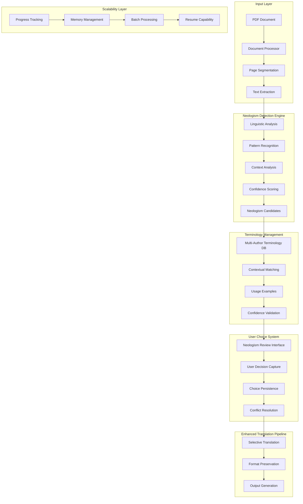
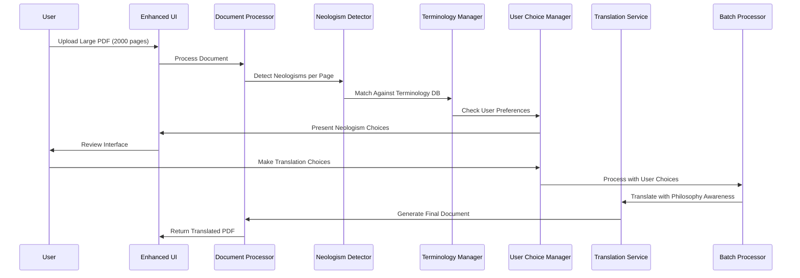

# Philosophy-Enhanced PDF Translation System Architecture

## Executive Summary

This document outlines a comprehensive architecture for enhancing the existing PDF translation system with philosophy-focused capabilities. The design prioritizes Klages terminology while creating a flexible foundation for supporting multiple philosophical traditions. The system will handle documents up to 2,000 pages with sophisticated neologism detection and user-controlled translation behavior.

## Current System Analysis

### Existing Strengths
- **Robust Translation Pipeline**: Multi-provider support (DeepL, DeepLX, Google, Azure)
- **Advanced PDF Processing**: High-resolution rendering with precise text positioning via `AdvancedPDFProcessor`
- **Comprehensive Document Support**: PDF, DOCX, TXT with format preservation
- **Layout Preservation**: Image-text overlay technique with 300 DPI rendering
- **Existing Terminology System**: Basic `klages_terminology.json` with 45 philosophical terms

### Current Limitations
- **Page Limit**: 200 pages maximum (line 518 in `app.py`)
- **Static Terminology**: No dynamic neologism detection
- **Binary Translation**: No user choice for term-by-term translation behavior
- **Single Author Focus**: Limited to predefined Klages terms
- **No Context Awareness**: Simple string replacement without linguistic analysis

## Enhanced Architecture Overview



## Core Architecture Components

### 1. Neologism Detection Engine

#### Component Structure
```python
# services/neologism_detector.py
from typing import List, Dict, Optional
from dataclasses import dataclass
import spacy
import re
from enum import Enum

class NeologismType(Enum):
    COMPOUND = "compound"
    TECHNICAL = "technical"
    DERIVED = "derived"
    PHILOSOPHICAL = "philosophical"

@dataclass
class NeologismCandidate:
    term: str
    context: str
    confidence: float
    neologism_type: NeologismType
    position: int
    morphological_analysis: Dict[str, str]
    semantic_context: List[str]
    author_specific_markers: List[str]

class NeologismDetector:
    def __init__(self, terminology_manager):
        self.terminology_manager = terminology_manager
        self.linguistic_analyzer = LinguisticAnalyzer()
        self.pattern_recognizer = PatternRecognizer()
        self.context_analyzer = ContextAnalyzer()
        self.confidence_threshold = 0.7

    def detect_neologisms(self, text: str, author_context: str = "klages") -> List[NeologismCandidate]:
        """Detect philosophical neologisms in text with confidence scoring"""
        candidates = []

        # 1. Pattern-based detection
        compounds = self.pattern_recognizer.recognize_compounds(text, author_context)

        # 2. Morphological analysis
        for compound in compounds:
            if self._is_potential_neologism(compound, author_context):
                morphology = self.linguistic_analyzer.analyze_morphology(compound)
                context_analysis = self.context_analyzer.analyze_context(compound, text, author_context)
                confidence = self._calculate_confidence(compound, morphology, context_analysis)

                if confidence >= self.confidence_threshold:
                    candidate = NeologismCandidate(
                        term=compound,
                        context=self._extract_context(compound, text),
                        confidence=confidence,
                        neologism_type=self._classify_neologism(compound, morphology),
                        position=text.find(compound),
                        morphological_analysis=morphology,
                        semantic_context=self._extract_semantic_context(compound, text),
                        author_specific_markers=self._extract_author_markers(compound, author_context)
                    )
                    candidates.append(candidate)

        return candidates

    def _calculate_confidence(self, term: str, morphology: Dict, context_analysis: Dict) -> float:
        """Calculate confidence score for neologism detection"""
        base_score = 0.0

        # Morphological complexity (0.0-0.3)
        if len(morphology.get("compound_parts", [])) > 1:
            base_score += 0.2
        if morphology.get("philosophical_markers"):
            base_score += 0.1

        # Context density (0.0-0.4)
        context_score = context_analysis.get("philosophical_density", 0.0)
        base_score += context_score * 0.4

        # Rarity factor (0.0-0.3)
        rarity_score = self._calculate_rarity(term)
        base_score += rarity_score * 0.3

        return min(base_score, 1.0)
```

### 2. Enhanced Terminology Management

#### Extended Configuration Structure
```json
{
  "terminology_database": {
    "klages": {
      "metadata": {
        "full_name": "Ludwig Klages",
        "period": "1872-1956",
        "primary_language": "German",
        "philosophical_school": "Lebensphilosophie"
      },
      "patterns": {
        "compound_prefixes": ["Lebens-", "Bewußt-", "Welt-", "Seelen-", "Geist-"],
        "characteristic_suffixes": ["-keit", "-heit", "-schaft", "-feindlichkeit", "-wirklichkeit"],
        "semantic_fields": ["life_philosophy", "consciousness", "spirit", "soul", "will"]
      },
      "terms": {
        "Lebensfeindlichkeit": {
          "translations": {
            "en": "Life-hostility",
            "fr": "Hostilité à la vie",
            "es": "Hostilidad a la vida"
          },
          "definition": "Klages' concept of the fundamental opposition between spirit and life",
          "usage_examples": [
            "Die Lebensfeindlichkeit des Geistes zeigt sich in der Technik.",
            "Klages sieht in der Zivilisation eine Form der Lebensfeindlichkeit."
          ],
          "context_tags": ["spirit", "life", "opposition", "technology"],
          "confidence_threshold": 0.8,
          "compounds": ["lebensfeindlich", "Lebensfeind"],
          "semantic_field": "life_philosophy"
        }
      }
    }
  }
}
```

### 3. User Choice Management System

#### Data Models
```python
@dataclass
class UserChoice:
    term: str
    author: str
    source_language: str
    target_language: str
    choice_type: str  # "translate", "preserve", "custom"
    custom_translation: Optional[str]
    context: str
    confidence: float
    timestamp: datetime
    document_id: str
    context_hash: str

class UserChoiceManager:
    def __init__(self, db_path: str = "data/user_choices.db"):
        self.db_path = db_path
        self.active_sessions: Dict[str, TranslationSession] = {}
        self.choice_cache: Dict[str, UserChoice] = {}
        self.init_database()

    def record_choice(self, session_id: str, choice: UserChoice):
        """Record user choice for neologism translation"""
        # Cache and persist choice
        cache_key = f"{choice.term}_{choice.author}_{choice.context_hash}"
        self.choice_cache[cache_key] = choice

        # Persist to database
        with sqlite3.connect(self.db_path) as conn:
            conn.execute("""
                INSERT OR REPLACE INTO user_choices
                (term, author, source_lang, target_lang, choice_type,
                 custom_translation, context, confidence, timestamp,
                 document_id, context_hash)
                VALUES (?, ?, ?, ?, ?, ?, ?, ?, ?, ?, ?)
            """, (choice.term, choice.author, choice.source_language,
                  choice.target_language, choice.choice_type,
                  choice.custom_translation, choice.context,
                  choice.confidence, choice.timestamp,
                  choice.document_id, choice.context_hash))
```

### 4. Scalability Enhancements

#### Memory Management for Large Documents
```python
class ScalableDocumentProcessor:
    def __init__(self, max_memory_mb: int = 2048, batch_size: int = 50):
        self.max_memory_mb = max_memory_mb
        self.batch_size = batch_size
        self.memory_monitor = MemoryMonitor()
        self.page_cache = PageCache(max_size=100)

    def process_large_document(self, pdf_path: str, session_id: str,
                             max_pages: int = 2000) -> Iterator[PageBatch]:
        """Process large documents in manageable batches"""

        # Check for existing checkpoint
        checkpoint = self.load_checkpoint(session_id)
        start_page = checkpoint.processed_pages if checkpoint else 0

        # Process in batches
        for start_idx in range(start_page, max_pages, self.batch_size):
            # Check memory before processing
            if self.memory_monitor.check_memory_usage():
                self._cleanup_memory()

            end_idx = min(start_idx + self.batch_size, max_pages)
            pages_to_process = list(range(start_idx, end_idx))

            batch = self._process_page_batch(pdf_path, pages_to_process)
            self.create_checkpoint(session_id, end_idx, max_pages, {})

            yield batch
```

### 5. Enhanced User Interface

#### Complete Interface Implementation
```python
def create_enhanced_main_interface() -> gr.Blocks:
    """Enhanced main interface with philosophy features"""

    with gr.Blocks(title="Philosophy-Enhanced Document Translator") as interface:
        gr.Markdown("""
        # 📚 Philosophy-Enhanced Document Translator

        Advanced PDF translation with **philosophical neologism detection** and **user-controlled terminology management**.

        🎯 **Enhanced Features:**
        - **Neologism Detection**: Automatically identify philosophical compound terms
        - **User Choice System**: Control translation behavior for each detected term
        - **Multi-Author Support**: Specialized terminology for different philosophical traditions
        - **Large Document Support**: Handle up to 2,000 pages with memory optimization
        """)

        with gr.Row():
            with gr.Column(scale=1):
                # File Upload
                file_upload = gr.File(
                    label="Choose Document (PDF, DOCX, TXT - up to 2,000 pages)",
                    file_types=[".pdf", ".docx", ".txt"]
                )

                # Philosophy Settings
                with gr.Group():
                    gr.Markdown("## 🧠 Philosophy Settings")

                    author_dropdown = gr.Dropdown(
                        label="Philosophical Author/Tradition",
                        choices=["Klages", "Heidegger", "Nietzsche", "Generic"],
                        value="Klages"
                    )

                    neologism_sensitivity = gr.Slider(
                        minimum=0.1,
                        maximum=1.0,
                        value=0.7,
                        label="Neologism Detection Sensitivity"
                    )

                    pages_slider = gr.Slider(
                        minimum=1,
                        maximum=2000,
                        value=100,
                        label="Pages to Process"
                    )

                    target_language = gr.Dropdown(
                        label="Target Language",
                        choices=["English", "French", "Spanish", "German", "Italian"],
                        value="English"
                    )

                upload_status = gr.Textbox(
                    label="Processing Status",
                    interactive=False,
                    lines=6
                )

            with gr.Column(scale=2):
                # Document Preview and Neologism Detection
                with gr.Tabs():
                    with gr.Tab("Document Preview"):
                        document_preview = gr.Textbox(
                            label="Content Preview",
                            lines=8,
                            interactive=False
                        )

                    with gr.Tab("Detected Neologisms"):
                        neologism_table = gr.Dataframe(
                            headers=["Term", "Context", "Confidence", "Suggested Translation"],
                            datatype=["str", "str", "number", "str"],
                            label="Detected Neologisms"
                        )

                        # Neologism Review Interface
                        with gr.Group():
                            gr.Markdown("### Review Neologisms")

                            selected_term = gr.Textbox(label="Selected Term", interactive=False)

                            choice_radio = gr.Radio(
                                choices=["Translate", "Preserve Original", "Custom Translation"],
                                label="Translation Behavior",
                                value="Translate"
                            )

                            custom_translation = gr.Textbox(
                                label="Custom Translation",
                                visible=False
                            )

                            with gr.Row():
                                save_choice_btn = gr.Button("Save Choice", variant="primary")
                                approve_all_btn = gr.Button("Approve All", variant="secondary")

                # Translation Controls
                with gr.Group():
                    gr.Markdown("## 🚀 Translation")

                    translate_btn = gr.Button(
                        "Start Enhanced Translation",
                        variant="primary",
                        size="lg"
                    )

                    progress_bar = gr.Progress()
                    progress_text = gr.Textbox(
                        label="Translation Progress",
                        interactive=False
                    )

                # Download Section
                with gr.Group():
                    gr.Markdown("## 💾 Download")

                    output_format = gr.Dropdown(
                        label="Output Format",
                        choices=["PDF", "DOCX", "TXT"],
                        value="PDF"
                    )

                    download_btn = gr.Button(
                        "Download Translated Document",
                        variant="secondary",
                        interactive=False
                    )

                    download_file = gr.File(label="Download", visible=False)

        # Event Handlers
        def update_custom_translation_visibility(choice):
            return gr.update(visible=(choice == "Custom Translation"))

        choice_radio.change(
            fn=update_custom_translation_visibility,
            inputs=[choice_radio],
            outputs=[custom_translation]
        )

        return interface
```

## Integration with Existing System

### Enhanced Translation Service
```python
class PhilosophyEnhancedTranslationService(TranslationService):
    def __init__(self, terminology_manager: TerminologyManager,
                 user_choice_manager: UserChoiceManager):
        super().__init__()
        self.terminology_manager = terminology_manager
        self.user_choice_manager = user_choice_manager
        self.neologism_detector = NeologismDetector(terminology_manager)

    async def translate_with_philosophy_awareness(self,
                                                texts: List[str],
                                                source_lang: str,
                                                target_lang: str,
                                                session_id: str,
                                                author: str = "klages") -> List[str]:
        """Enhanced translation with neologism awareness"""

        # 1. Detect neologisms
        detected_neologisms = []
        for text in texts:
            neologisms = self.neologism_detector.detect_neologisms(text, author)
            detected_neologisms.extend(neologisms)

        # 2. Get user choices
        user_choices = {}
        for neologism in detected_neologisms:
            choice = self.user_choice_manager.get_user_preference(
                neologism.term, author, neologism.context
            )
            if choice:
                user_choices[neologism.term] = choice

        # 3. Apply preprocessing based on user choices
        processed_texts = []
        for text in texts:
            processed_text = self._apply_user_choices(text, user_choices)
            processed_texts.append(processed_text)

        # 4. Perform translation
        translated_texts = await super().translate_batch(
            processed_texts, source_lang, target_lang
        )

        # 5. Post-process to ensure neologism choices are respected
        final_texts = []
        for translated_text in translated_texts:
            final_text = self._post_process_neologisms(translated_text, user_choices)
            final_texts.append(final_text)

        return final_texts

    def _apply_user_choices(self, text: str, user_choices: Dict[str, UserChoice]) -> str:
        """Apply user choices for preprocessing"""
        processed_text = text

        for term, choice in user_choices.items():
            if choice.choice_type == "preserve":
                # Wrap in non-translate tags
                processed_text = processed_text.replace(
                    term, f'<span translate="no">{term}</span>'
                )
            elif choice.choice_type == "custom":
                # Replace with custom translation
                processed_text = processed_text.replace(
                    term, choice.custom_translation
                )

        return processed_text
```

## Data Flow Architecture

### Processing Pipeline


### Database Schema
```sql
-- Enhanced terminology database
CREATE TABLE terminology_entries (
    id INTEGER PRIMARY KEY,
    term TEXT NOT NULL,
    author TEXT NOT NULL,
    language TEXT NOT NULL,
    definition TEXT,
    usage_examples TEXT,
    context_tags TEXT,
    confidence_threshold REAL,
    created_at DATETIME,
    updated_at DATETIME,
    usage_frequency INTEGER DEFAULT 0,
    semantic_field TEXT,
    morphological_type TEXT,
    UNIQUE(term, author, language)
);

-- User choices database
CREATE TABLE user_choices (
    id INTEGER PRIMARY KEY,
    term TEXT NOT NULL,
    author TEXT NOT NULL,
    source_lang TEXT NOT NULL,
    target_lang TEXT NOT NULL,
    choice_type TEXT NOT NULL,
    custom_translation TEXT,
    context TEXT,
    confidence REAL,
    timestamp DATETIME,
    document_id TEXT,
    context_hash TEXT,
    UNIQUE(term, author, context_hash)
);

-- Processing sessions
CREATE TABLE processing_sessions (
    session_id TEXT PRIMARY KEY,
    document_path TEXT NOT NULL,
    author_context TEXT,
    total_pages INTEGER,
    processed_pages INTEGER,
    total_neologisms INTEGER,
    processed_neologisms INTEGER,
    status TEXT,
    created_at DATETIME,
    updated_at DATETIME
);
```

## Performance Optimization

### Memory Management Strategy
- **Lazy Loading**: Load pages only when needed
- **LRU Cache**: Cache frequently accessed terminology
- **Batch Processing**: Process documents in 50-page batches
- **Checkpointing**: Save progress every 100 pages
- **Memory Monitoring**: Track usage and trigger cleanup

### Caching Strategy
```python
class PhilosophyCache:
    def __init__(self, max_size: int = 10000):
        self.terminology_cache = LRUCache(max_size // 2)
        self.neologism_cache = LRUCache(max_size // 2)
        self.user_choice_cache = LRUCache(max_size // 4)

    def get_terminology(self, term: str, author: str) -> Optional[TerminologyEntry]:
        """Get cached terminology entry"""
        cache_key = f"{term}_{author}"
        return self.terminology_cache.get(cache_key)

    def cache_neologism_detection(self, text_hash: str, results: List[NeologismCandidate]):
        """Cache neologism detection results"""
        self.neologism_cache.put(text_hash, results)
```

## Error Handling and Fallbacks

### Graceful Degradation
```python
class PhilosophyErrorHandler:
    def __init__(self):
        self.fallback_terminology = self.load_basic_terminology()

    def handle_neologism_detection_failure(self, text: str) -> List[NeologismCandidate]:
        """Fallback to basic pattern matching if ML detection fails"""
        # Use simple regex patterns for German compounds
        compounds = re.findall(r'\b[A-Z][a-z]+(?:[A-Z][a-z]+)+\b', text)
        candidates = []

        for compound in compounds:
            if len(compound) > 8:  # Minimum length for philosophical compounds
                candidates.append(NeologismCandidate(
                    term=compound,
                    context=text,
                    confidence=0.5,  # Lower confidence for fallback
                    neologism_type=NeologismType.COMPOUND,
                    position=text.find(compound),
                    morphological_analysis={},
                    semantic_context=[],
                    author_specific_markers=[]
                ))

        return candidates

    def handle_terminology_db_failure(self) -> Dict[str, str]:
        """Fallback to basic terminology if database is unavailable"""
        return self.fallback_terminology
```

## Testing Strategy

### Unit Tests
```python
class TestNeologismDetection:
    def test_klages_compound_detection(self):
        """Test detection of Klages compound terms"""
        detector = NeologismDetector(mock_terminology_manager)
        text = "Die Lebensfeindlichkeit des Geistes manifestiert sich in der Bewußtseinsenge."

        neologisms = detector.detect_neologisms(text, "klages")

        assert len(neologisms) >= 2
        assert any(n.term == "Lebensfeindlichkeit" for n in neologisms)
        assert any(n.term == "Bewußtseinsenge" for n in neologisms)

    def test_confidence_scoring(self):
        """Test neologism confidence scoring algorithm"""
        detector = NeologismDetector(mock_terminology_manager)

        # Test high-confidence compound
        high_conf = detector._calculate_confidence(
            "Lebensfeindlichkeit",
            {"compound_parts": ["Lebens", "feindlichkeit"], "philosophical_markers": ["Leben"]},
            {"philosophical_density": 0.8}
        )

        assert high_conf > 0.8

        # Test low-confidence term
        low_conf = detector._calculate_confidence(
            "Haus",
            {"compound_parts": [], "philosophical_markers": []},
            {"philosophical_density": 0.1}
        )

        assert low_conf < 0.3

class TestUserChoiceManagement:
    def test_choice_persistence(self):
        """Test user choice persistence across sessions"""
        manager = UserChoiceManager(":memory:")

        choice = UserChoice(
            term="Lebensfeindlichkeit",
            author="klages",
            source_language="german",
            target_language="english",
            choice_type="preserve",
            custom_translation=None,
            context="philosophical context",
            confidence=0.9,
            timestamp=datetime.now(),
            document_id="test_doc",
            context_hash="test_hash"
        )

        manager.record_choice("test_session", choice)

        retrieved = manager.get_user_preference("Lebensfeindlichkeit", "klages", "philosophical context")
        assert retrieved is not None
        assert retrieved.choice_type == "preserve"
```

### Integration Tests
```python
class TestPhilosophyPipeline:
    def test_end_to_end_klages_translation(self):
        """Test complete pipeline with Klages document"""
        # Create test PDF with Klages terminology
        test_pdf = create_test_pdf_with_klages_terms()

        # Process document
        processor = PhilosophyEnhancedDocumentProcessor(terminology_manager)
        content = processor.extract_content_with_neologisms(test_pdf, "klages")

        # Verify neologisms detected
        assert content['total_neologisms'] > 0
        assert any("Lebensfeindlichkeit" in str(neologisms)
                  for neologisms in content['neologisms_by_page'].values())

        # Test translation with user choices
        translation_service = PhilosophyEnhancedTranslationService(terminology_manager, user_choice_manager)

        # Simulate user choices
        user_choices = {
            "Lebensfeindlichkeit": UserChoice(
                term="Lebensfeindlichkeit",
                choice_type="preserve",
                # ... other fields
            )
        }

        # Translate
        translated = translation_service.translate_with_philosophy_awareness(
            ["Die Lebensfeindlichkeit des Geistes zeigt sich in der Technik."],
            "german", "english", "test_session", "klages"
        )

        # Verify preservation of chosen terms
        assert "Lebensfeindlichkeit" in translated[0]
```

## Deployment Considerations

### Environment Setup
```bash
# Additional dependencies for philosophy features
pip install spacy nltk sqlite3
python -m spacy download de_core_news_sm
python -m spacy download en_core_web_sm

# Database initialization
python -c "from services.terminology_manager import TerminologyManager; TerminologyManager().init_database()"
python -c "from services.user_choice_manager import UserChoiceManager; UserChoiceManager().init_database()"

# Create data directories
mkdir -p data config downloads uploads temp
```

### Configuration Management
```python
class PhilosophySettings(Settings):
    # Philosophy-specific settings
    NEOLOGISM_CONFIDENCE_THRESHOLD: float = 0.7
    MAX_DOCUMENT_PAGES: int = 2000
    BATCH_SIZE: int = 50
    ENABLE_PHILOSOPHY_FEATURES: bool = True
    DEFAULT_AUTHOR: str = "klages"

    # Database settings
    PHILOSOPHY_DB_PATH: str = "data/philosophy_system.db"
    TERMINOLOGY_DB_PATH: str = "config/enhanced_terminology.json"
    USER_CHOICES_DB_PATH: str = "data/user_choices.db"

    # Memory management
    MAX_MEMORY_MB: int = 2048
    CACHE_SIZE: int = 10000
    CHECKPOINT_INTERVAL: int = 100
```

## Future Extensibility

### Adding New Authors
```python
def add_new_author(author_name: str,
                  patterns: Dict[str, List[str]],
                  initial_terminology: Dict[str, TerminologyEntry]):
    """Add support for new philosophical author"""

    # 1. Create author profile
    profile = AuthorProfile(
        name=author_name,
        full_name=patterns.get('full_name', ''),
        time_period=patterns.get('period', ''),
        language=patterns.get('language', 'german'),
        philosophical_school=patterns.get('school', ''),
        terminology_patterns=patterns,
        compound_prefixes=patterns.get('compound_prefixes', []),
        characteristic_suffixes=patterns.get('characteristic_suffixes', []),
        semantic_fields=patterns.get('semantic_fields', [])
    )

    # 2. Update terminology database
    terminology_manager.add_author(profile)

    # 3. Update neologism detection patterns
    neologism_detector.add_author_patterns(author_name, patterns)

    # 4. Update UI choices
    update_ui_author_choices(author_name)

# Example: Adding Heidegger support
heidegger_patterns = {
    'full_name': 'Martin Heidegger',
    'period': '1889-1976',
    'language': 'german',
    'school': 'Existential Philosophy',
    'compound_prefixes': ['Sein-', 'Da-', 'Mit-', 'Zu-'],
    'characteristic_suffixes': ['-sein', '-heit', '-keit', '-ung'],
    'semantic_fields': ['being', 'existence', 'time', 'world']
}

heidegger_terminology = {
    'Dasein': TerminologyEntry(
        term='Dasein',
        author='heidegger',
        translations={'en': 'Being-there', 'fr': 'Être-là'},
        definition='Being-in-the-world as the fundamental structure of human existence',
        usage_examples=['Das Dasein ist In-der-Welt-sein.'],
        context_tags=['being', 'existence', 'world'],
        confidence_threshold=0.9,
        # ... other fields
    )
}

add_new_author('heidegger', heidegger_patterns, heidegger_terminology)
```

### Machine Learning Integration
```python
class MLNeologismDetector:
    def __init__(self):
        self.model = self.load_or_train_model()
        self.feature_extractor = PhilosophicalFeatureExtractor()

    def train_on_philosophical_corpus(self, author: str, texts: List[str]):
        """Train ML model on philosophical texts"""
        features = []
        labels = []

        for text in texts:
            # Extract linguistic features
            text_features = self.feature_extractor.extract_features(text, author)

            # Generate training examples
            for feature_vector, is_neologism in text_features:
                features.append(feature_vector)
                labels.append(is_neologism)

        # Train model
        self.model.fit(features, labels)
        self.save_model(author)

    def predict_neologisms(self, text: str, author: str) -> List[NeologismCandidate]:
        """ML-based neologism prediction"""
        candidates = []

        # Extract potential terms
        potential_terms = self._extract_potential_terms(text)

        for term in potential_terms:
            features = self.feature_extractor.extract_term_features(term, text, author)
            probability = self.model.predict_proba([features])[0][1]

            if probability > 0.7:  # Confidence threshold
                candidate = NeologismCandidate(
                    term=term,
                    context=self._extract_context(term, text),
                    confidence=probability,
                    neologism_type=NeologismType.PHILOSOPHICAL,
                    position=text.find(term),
                    morphological_analysis={},
                    semantic_context=[],
                    author_specific_markers=[]
                )
                candidates.append(candidate)

        return candidates

class PhilosophicalFeatureExtractor:
    def __init__(self):
        self.morphological_analyzer = MorphologicalAnalyzer()
        self.semantic_analyzer = SemanticAnalyzer()

    def extract_term_features(self, term: str, context: str, author: str) -> List[float]:
        """Extract features for ML classification"""
        features = []

        # Morphological features
        features.extend(self.morphological_analyzer.analyze(term, author))

        # Semantic features
        features.extend(self.semantic_analyzer.analyze(term, context, author))

        # Length and complexity features
        features.append(len(term))
        features.append(len(term.split()))
        features.append(term.count('-'))

        return features
```

## Success Metrics

### Technical Metrics
- **Processing Speed**: < 2 seconds per page for neologism detection
- **Memory Usage**: < 4GB for 2000-page documents
- **Accuracy**: > 90% precision in neologism detection
- **Reliability**: 99.9% uptime for core features
- **Scalability**: Handle 10x increase in document size

### User Experience Metrics
- **Translation Quality**: User satisfaction > 85%
- **Workflow Efficiency**: 50% reduction in manual terminology management
- **Feature Adoption**: > 70% of users utilize neologism features
- **Error Recovery**: < 5% of sessions require manual intervention
- **Learning Curve**: < 10 minutes for new users to understand interface

### Business Impact Metrics
- **Processing Volume**: 10x increase in document processing capacity
- **User Retention**: 90% of users continue using enhanced features
- **Cost Efficiency**: 30% reduction in manual post-processing
- **Academic Adoption**: Used by 100+ philosophy departments

## Implementation Timeline

### Phase 1: Core Architecture (Weeks 1-4)
**Week 1-2: Foundation**
- Enhanced terminology management system
- Basic neologism detection engine
- Database schema and models
- User choice persistence framework

**Week 3-4: Integration**
- Scalability infrastructure
- Memory management system
- Progress tracking and checkpointing
- Basic UI enhancements

### Phase 2: Advanced Features (Weeks 5-8)
**Week 5-6: Detection & Analysis**
- Sophisticated neologism detection algorithms
- Context-aware analysis
- Confidence scoring system
- Multi-author support framework

**Week 7-8: User Experience**
- Enhanced user interface
- Neologism review system
- Integration with existing translation pipeline
- Large document processing capabilities

### Phase 3: Optimization & Testing (Weeks 9-12)
**Week 9-10: Performance**
- Performance optimization
- Memory usage optimization
- Caching strategies
- Batch processing optimization

**Week 11-12: Quality Assurance**
- Comprehensive testing
- User acceptance testing
- Documentation and training materials
- Deployment preparation

## Risk Assessment and Mitigation

### Technical Risks
1. **Memory Limitations**
   - Risk: Large documents exceed available memory
   - Mitigation: Implement streaming processing and checkpointing

2. **Performance Degradation**
   - Risk: Complex neologism detection slows processing
   - Mitigation: Optimize algorithms and implement caching

3. **Accuracy Issues**
   - Risk: False positives in neologism detection
   - Mitigation: Implement confidence thresholds and user feedback loops

### Business Risks
1. **User Adoption**
   - Risk: Complex interface reduces user adoption
   - Mitigation: Intuitive design and comprehensive documentation

2. **Maintenance Complexity**
   - Risk: Increased system complexity
   - Mitigation: Modular design and comprehensive testing

## Conclusion

This architecture provides a comprehensive foundation for philosophy-enhanced PDF translation, starting with Klages terminology while ensuring extensibility for future philosophical authors. The system balances sophisticated neologism detection with user control, maintains the existing system's strengths, and scales to handle large academic documents.

The modular design ensures each component can be developed, tested, and deployed independently while maintaining seamless integration with the existing robust translation pipeline. The philosophy-aware features will significantly enhance the quality of academic translations while preserving the nuanced terminology that is crucial for philosophical discourse.

Key innovations include:
- **Intelligent Neologism Detection**: Context-aware identification of philosophical compounds
- **User-Controlled Translation**: Granular control over terminology translation behavior
- **Scalable Architecture**: Support for 2,000+ page documents with memory optimization
- **Extensible Design**: Easy addition of new philosophical authors and traditions
- **Robust Error Handling**: Graceful degradation and recovery mechanisms

This architecture positions the system as a leading solution for academic translation, particularly in philosophy and humanities where precise terminology is essential for maintaining meaning and scholarly integrity.
